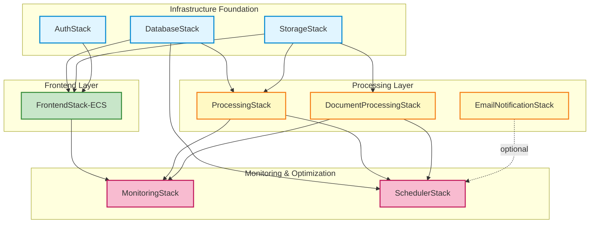
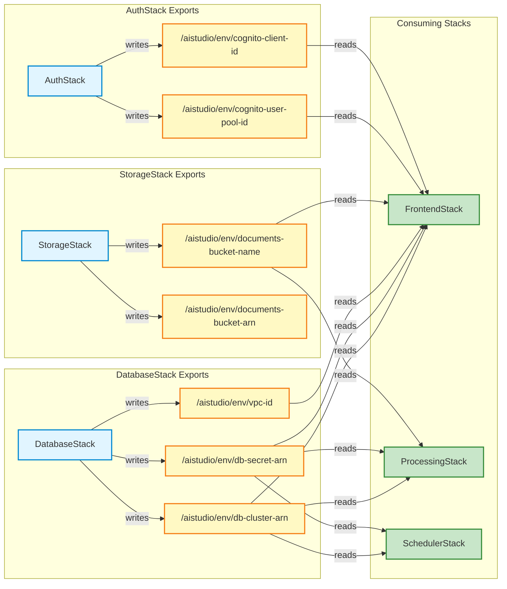

# CDK Stack Dependency Graph

This diagram shows the deployment order and SSM parameter dependencies between AWS CDK stacks.

## Deployment Order



## SSM Parameter Store Flow



## Deployment Commands

### Deploy All Stacks (Recommended Order)
```bash
cd infra

# Step 1: Foundation stacks (parallel)
npx cdk deploy AIStudio-DatabaseStack-Dev AIStudio-AuthStack-Dev AIStudio-StorageStack-Dev

# Step 2: Processing layer (parallel, after foundation)
npx cdk deploy AIStudio-ProcessingStack-Dev AIStudio-DocumentProcessingStack-Dev

# Step 3: Frontend (requires foundation + processing)
npx cdk deploy AIStudio-FrontendStack-Dev

# Step 4: Monitoring (after all services deployed)
npx cdk deploy AIStudio-MonitoringStack-Dev AIStudio-SchedulerStack-Dev
```

### Deploy Single Stack (For Incremental Updates)
```bash
# Frontend only (for UI changes)
npx cdk deploy AIStudio-FrontendStack-Dev

# Database only (for schema changes)
npx cdk deploy AIStudio-DatabaseStack-Dev

# Processing only (for Lambda updates)
npx cdk deploy AIStudio-ProcessingStack-Dev
```

## Key Benefits of SSM Parameter Store Pattern

1. **Independent Deployment**: Stacks can be deployed independently without direct references
2. **Faster Iteration**: Update single stack without redeploying dependencies
3. **Cost Savings**: ~15-20 minute deployment → ~3-5 minutes for single stack
4. **Reduced Risk**: Smaller change sets reduce blast radius
5. **Multi-Environment**: Same parameter names across dev/prod with environment prefix

## Stack Descriptions

| Stack | Purpose | Deployment Time | Dependencies |
|-------|---------|-----------------|--------------|
| **DatabaseStack** | Aurora Serverless v2, VPC, RDS Data API | ~8-10 min | None |
| **AuthStack** | Cognito User Pool, Google OAuth integration | ~3-5 min | None |
| **StorageStack** | S3 buckets, lifecycle policies | ~2-3 min | None |
| **ProcessingStack** | Lambda workers, SQS queues for async processing | ~4-6 min | Database, Storage |
| **DocumentProcessingStack** | Document upload, Textract, embedding generation | ~4-6 min | Storage |
| **FrontendStack-ECS** | ECS Fargate, ALB, auto-scaling, CloudFront | ~10-12 min | Database, Auth, Storage |
| **MonitoringStack** | CloudWatch dashboards, alarms, ADOT | ~3-4 min | All services |
| **SchedulerStack** | EventBridge scheduled tasks, cron jobs | ~2-3 min | Database, Processing |

## Troubleshooting

### Stack Deployment Fails

**Symptom**: `AIStudio-FrontendStack-Dev` fails with "Parameter /aistudio/dev/db-cluster-arn not found"

**Solution**:
```bash
# Verify DatabaseStack exported parameters
aws ssm get-parameter --name "/aistudio/dev/db-cluster-arn"

# If missing, redeploy DatabaseStack
npx cdk deploy AIStudio-DatabaseStack-Dev
```

### Parameter Store Cleanup

If you need to clean up parameters for a fresh deployment:
```bash
# List all AI Studio parameters
aws ssm describe-parameters --filters "Key=Name,Values=/aistudio/"

# Delete environment-specific parameters
aws ssm delete-parameters --names \
  "/aistudio/dev/db-cluster-arn" \
  "/aistudio/dev/db-secret-arn" \
  "/aistudio/dev/documents-bucket-name"
```

---

**Last Updated**: November 2025
**Related Docs**: `/docs/DEPLOYMENT.md`, `/docs/ARCHITECTURE.md`
