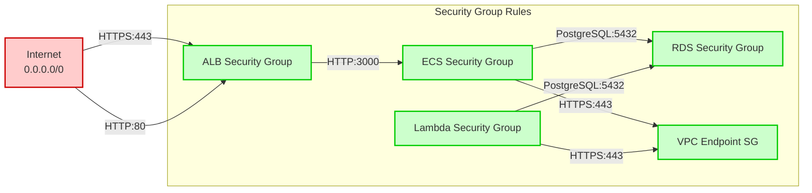

# VPC Network Topology

This diagram shows the consolidated VPC architecture with subnet layout, security groups, and VPC endpoints.

## Network Architecture Overview

```mermaid
graph TB
    subgraph "Internet"
        IGW[Internet Gateway]
    end

    subgraph "AI Studio VPC (10.0.0.0/16)"
        subgraph "Availability Zone A (us-east-1a)"
            subgraph "Public Subnet A (10.0.0.0/24)"
                NAT_A[NAT Gateway A]
                ALB_A[ALB Node A]
            end

            subgraph "Private-Application Subnet A (10.0.16.0/20)"
                ECS_A[ECS Fargate Tasks]
                LAMBDA_A[Lambda Functions]
            end

            subgraph "Private-Data Subnet A (10.0.48.0/20)"
                RDS_A[Aurora Primary]
            end

            subgraph "Isolated Subnet A (10.0.80.0/20)"
                BACKUP_A[Backup Resources]
            end
        end

        subgraph "Availability Zone B (us-east-1b)"
            subgraph "Public Subnet B (10.0.1.0/24)"
                NAT_B[NAT Gateway B]
                ALB_B[ALB Node B]
            end

            subgraph "Private-Application Subnet B (10.0.32.0/20)"
                ECS_B[ECS Fargate Tasks]
                LAMBDA_B[Lambda Functions]
            end

            subgraph "Private-Data Subnet B (10.0.64.0/20)"
                RDS_B[Aurora Replica]
            end

            subgraph "Isolated Subnet B (10.0.96.0/20)"
                BACKUP_B[Backup Resources]
            end
        end

        subgraph "VPC Endpoints (Private Link)"
            EP_S3[S3 Gateway Endpoint]
            EP_DDB[DynamoDB Gateway Endpoint]
            EP_ECR_API[ECR API Endpoint]
            EP_ECR_DKR[ECR Docker Endpoint]
            EP_SECRETS[Secrets Manager Endpoint]
            EP_SSM[SSM Endpoint]
            EP_RDS[RDS Data API Endpoint]
            EP_BEDROCK[Bedrock Runtime Endpoint]
        end
    end

    subgraph "AWS Services"
        S3[Amazon S3]
        DDB[DynamoDB]
        ECR[Elastic Container Registry]
        SECRETS[Secrets Manager]
        SSM[Systems Manager]
        BEDROCK[Amazon Bedrock]
    end

    %% Internet connectivity
    IGW --> ALB_A
    IGW --> ALB_B
    ALB_A --> ECS_A
    ALB_B --> ECS_B

    %% NAT Gateway routing
    NAT_A --> IGW
    NAT_B --> IGW
    ECS_A -.outbound.-> NAT_A
    ECS_B -.outbound.-> NAT_B
    LAMBDA_A -.outbound.-> NAT_A
    LAMBDA_B -.outbound.-> NAT_B

    %% Database connectivity
    ECS_A --> RDS_A
    ECS_B --> RDS_B
    LAMBDA_A --> RDS_A
    LAMBDA_B --> RDS_B

    %% VPC Endpoint connectivity
    ECS_A --> EP_S3
    ECS_B --> EP_S3
    ECS_A --> EP_ECR_API
    ECS_B --> EP_ECR_DKR
    LAMBDA_A --> EP_SECRETS
    LAMBDA_B --> EP_SSM
    ECS_A --> EP_BEDROCK

    EP_S3 --> S3
    EP_DDB --> DDB
    EP_ECR_API --> ECR
    EP_ECR_DKR --> ECR
    EP_SECRETS --> SECRETS
    EP_SSM --> SSM
    EP_BEDROCK --> BEDROCK

    classDef public fill:#ffcccc,stroke:#cc0000,stroke-width:2px
    classDef private fill:#ccffcc,stroke:#00cc00,stroke-width:2px
    classDef data fill:#ccccff,stroke:#0000cc,stroke-width:2px
    classDef isolated fill:#ffff99,stroke:#cccc00,stroke-width:2px
    classDef endpoint fill:#e1f5ff,stroke:#0288d1,stroke-width:2px

    class NAT_A,NAT_B,ALB_A,ALB_B public
    class ECS_A,ECS_B,LAMBDA_A,LAMBDA_B private
    class RDS_A,RDS_B data
    class BACKUP_A,BACKUP_B isolated
    class EP_S3,EP_DDB,EP_ECR_API,EP_ECR_DKR,EP_SECRETS,EP_SSM,EP_RDS,EP_BEDROCK endpoint
```



## Subnet Design

### Public Subnets (10.0.0.0/24, 10.0.1.0/24)
- **Purpose**: Internet-facing resources
- **Resources**:
  - NAT Gateways (for outbound traffic)
  - Application Load Balancer nodes
- **Route Table**: Default route to Internet Gateway

### Private-Application Subnets (10.0.16.0/20, 10.0.32.0/20)
- **Purpose**: Application tier (ECS, Lambda)
- **Resources**:
  - ECS Fargate tasks (Next.js frontend)
  - Lambda functions (async processing)
- **Route Table**: Default route to NAT Gateway
- **Outbound**: Internet via NAT Gateway
- **Inbound**: Only from ALB

### Private-Data Subnets (10.0.48.0/20, 10.0.64.0/20)
- **Purpose**: Database tier
- **Resources**:
  - Aurora Serverless v2 cluster
  - RDS proxy (if enabled)
- **Route Table**: Local VPC only
- **Outbound**: Via VPC endpoints only
- **Inbound**: Only from private-application subnets

### Isolated Subnets (10.0.80.0/20, 10.0.96.0/20)
- **Purpose**: Backup and recovery resources
- **Resources**:
  - Database snapshots
  - Disaster recovery staging
- **Route Table**: No default route
- **Outbound**: None
- **Inbound**: None

## Security Groups



### Security Group Details

| Security Group | Inbound Rules | Outbound Rules |
|----------------|---------------|----------------|
| **ALB-SG** | 0.0.0.0/0 → 443 (HTTPS)<br/>0.0.0.0/0 → 80 (HTTP) | ECS-SG → 3000 (Next.js) |
| **ECS-SG** | ALB-SG → 3000<br/>Self → All (for service mesh) | RDS-SG → 5432 (PostgreSQL)<br/>VPC-EP-SG → 443 (AWS APIs)<br/>0.0.0.0/0 → 443 (AI APIs via NAT) |
| **Lambda-SG** | None | RDS-SG → 5432<br/>VPC-EP-SG → 443<br/>0.0.0.0/0 → 443 (via NAT) |
| **RDS-SG** | ECS-SG → 5432<br/>Lambda-SG → 5432 | None |
| **VPC-Endpoint-SG** | ECS-SG → 443<br/>Lambda-SG → 443 | All → 443 (to AWS services) |

## VPC Endpoints

### Gateway Endpoints (No Cost)
- **S3**: Document storage, CloudWatch Logs
- **DynamoDB**: Job status tracking

### Interface Endpoints (~$0.01/hour each)
- **ECR API**: Container image metadata
- **ECR Docker**: Container image layers
- **Secrets Manager**: API keys, OAuth secrets
- **SSM Parameter Store**: Cross-stack configuration
- **RDS Data API**: Database access (HTTP API)
- **Bedrock Runtime**: Claude AI model access
- **CloudWatch Logs**: Logging (optional)
- **STS**: IAM role assumption
- **Lambda**: Cross-VPC Lambda invocation

### Cost Savings from VPC Endpoints

**Without VPC Endpoints** (NAT Gateway data transfer):
- S3 uploads/downloads: ~100 GB/month × $0.045 = **$4.50**
- ECR pulls: ~50 GB/month × $0.045 = **$2.25**
- API calls: ~20 GB/month × $0.045 = **$0.90**
- **Total NAT cost**: ~$7.65/month

**With VPC Endpoints**:
- Interface endpoints: 8 × $0.01/hour × 730 hours = **$58.40/month**
- Gateway endpoints: **$0** (free)
- Data transfer savings: **-$7.65/month**

**Net Cost**: +$50.75/month for endpoints

**Why We Use Them**:
1. **Security**: Traffic never leaves AWS network
2. **Reliability**: No internet dependency
3. **Performance**: Lower latency (<5ms vs 20-50ms)
4. **Compliance**: Data residency requirements met

## Network Flow Examples

### User Request Flow
```
User Browser
  → CloudFront (optional CDN)
  → Route 53 (DNS: aistudio.psd401.ai)
  → ALB (Public Subnet)
  → ECS Fargate Task (Private-Application Subnet)
  → Aurora Database (Private-Data Subnet)
  → Response back through same path
```

### Document Processing Flow
```
ECS Task uploads file
  → S3 VPC Endpoint
  → S3 Bucket
  → S3 Event Notification
  → Lambda Function (Private-Application Subnet)
  → Textract API (via NAT Gateway)
  → Lambda writes chunks to Aurora (via Private-Data Subnet)
```

### AI Model Request Flow
```
ECS Task receives chat request
  → Bedrock VPC Endpoint (Private Link)
  → Amazon Bedrock (Claude model)
  → Streaming response via HTTP/2
  → ECS Task streams to client via ALB
```

## Network Performance

| Metric | Target | Actual |
|--------|--------|--------|
| **ALB → ECS Latency** | < 5ms | 2-3ms |
| **ECS → RDS Latency** | < 2ms | 1ms |
| **ECS → S3 (via endpoint)** | < 5ms | 3-4ms |
| **ECS → Bedrock (via endpoint)** | < 10ms | 7-9ms |
| **NAT Gateway throughput** | 5 Gbps | 2-3 Gbps |
| **VPC Endpoint throughput** | 10 Gbps | 5-8 Gbps |

## Disaster Recovery

### Multi-AZ Failover
- **Aurora**: Automatic failover to replica in AZ-B (< 30 seconds)
- **ALB**: Health checks route traffic to healthy AZ
- **ECS**: Auto-scaling replaces failed tasks in alternate AZ
- **NAT Gateway**: Redundant in both AZs

### VPC Peer Connectivity (Future)
- VPC peering for cross-region disaster recovery
- Direct Connect for on-premises connectivity
- Transit Gateway for multi-VPC architectures

## Monitoring

### CloudWatch Metrics
- VPC Flow Logs → S3 for security analysis
- NAT Gateway metrics (bandwidth, connections)
- VPC Endpoint metrics (request count, errors)
- Network interface metrics per ECS task

### Alarms
- NAT Gateway bandwidth > 80% capacity
- VPC Endpoint error rate > 1%
- RDS connection count > 80% of max
- ALB unhealthy target count > 0

---

**Last Updated**: November 2025
**Related Docs**: `/docs/ARCHITECTURE.md`, `/docs/DEPLOYMENT.md`
**CDK Implementation**: `/infra/lib/constructs/network/shared-vpc.ts`
