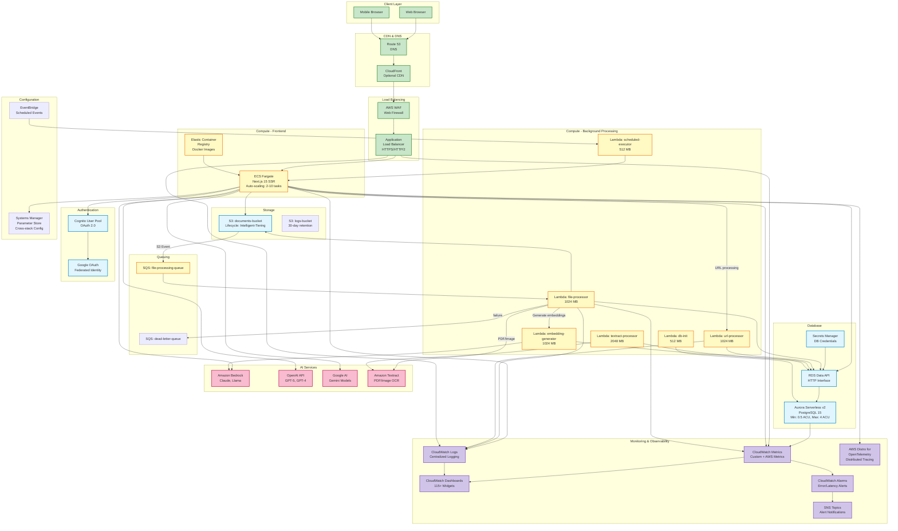

# AWS Service Architecture

High-level view of all AWS services and their interactions in the AI Studio application.

## Complete System Architecture



## Service Breakdown by Category

### Compute Services

| Service | Purpose | Configuration | Monthly Cost (Dev) |
|---------|---------|---------------|-------------------|
| **ECS Fargate** | Next.js SSR frontend | 0.5 vCPU, 1 GB RAM<br/>Auto-scale: 2-10 tasks | ~$30-60 |
| **Lambda Functions** | Async processing | Node.js 20.x<br/>512 MB - 2048 MB | ~$10-15 |
| **ECR** | Container images | Scan on push enabled | ~$2-3 |

### Database & Storage

| Service | Purpose | Configuration | Monthly Cost (Dev) |
|---------|---------|---------------|-------------------|
| **Aurora Serverless v2** | PostgreSQL database | Min: 0.5 ACU, Max: 4 ACU<br/>Auto-pause: 5 min idle | ~$15-25 (with pause) |
| **RDS Data API** | HTTP database access | Serverless, pay-per-request | ~$5-8 |
| **S3** | Document/log storage | Intelligent-Tiering<br/>Lifecycle rules | ~$3-5 |
| **Secrets Manager** | API keys, credentials | Auto-rotation enabled | ~$2-3 |

### AI & ML Services

| Service | Purpose | Pay-Per-Use Cost |
|---------|---------|------------------|
| **Amazon Bedrock** | Claude 3.5 Sonnet<br/>Llama 3.1 models | Input: $3/M tokens<br/>Output: $15/M tokens |
| **OpenAI API** | GPT-5, GPT-4 models | GPT-5: $2.50/M in, $10/M out<br/>GPT-4: $5/M in, $15/M out |
| **Google AI** | Gemini 1.5 Pro | Input: $1.25/M tokens<br/>Output: $5/M tokens |
| **Amazon Textract** | PDF/Image OCR | $1.50 per 1,000 pages |

### Monitoring Services

| Service | Purpose | Configuration | Monthly Cost |
|---------|---------|---------------|--------------|
| **CloudWatch Logs** | Centralized logging | 7-day retention (dev)<br/>30-day (prod) | ~$5-10 |
| **CloudWatch Metrics** | Performance monitoring | Custom + AWS metrics | ~$3-5 |
| **CloudWatch Dashboards** | Visualization | 115+ widgets across services | $3/dashboard |
| **ADOT** | Distributed tracing | Lambda layer + ECS sidecar | Included |
| **SNS** | Alert notifications | Email + SMS alerts | ~$1-2 |

## Data Flow Patterns

### Real-Time Chat Request
```
1. User sends message → ALB
2. ALB routes → ECS Fargate task
3. ECS validates session → Cognito
4. ECS fetches conversation → RDS Data API → Aurora
5. ECS calls AI provider → Bedrock/OpenAI/Gemini
6. AI streams response → ECS → ALB → User (Server-Sent Events)
7. ECS saves message + tokens → RDS Data API
```

**Latency Breakdown**:
- ALB → ECS: 2-3ms
- Session validation: 5-10ms (cached)
- Database query: 10-15ms
- AI model (first token): 200-500ms
- Streaming: Real-time (<100ms chunks)

### Document Upload & Processing
```
1. User uploads file → ECS
2. ECS validates + generates presigned URL → S3
3. Browser uploads directly → S3
4. S3 Event Notification → SQS
5. SQS triggers → file-processor Lambda
6. Lambda downloads → processes → chunks text
7. If PDF/image → textract-processor Lambda
8. Textract extracts text → Lambda
9. Lambda triggers → embedding-generator
10. Embedding generator → Bedrock (embeddings API)
11. Embeddings stored → Aurora (pgvector)
12. Status updates → Aurora (job_status table)
```

**Processing Time**:
- 1 MB text file: 2-5 seconds
- 10 MB PDF (100 pages): 30-60 seconds
- 50 MB PDF (500 pages): 3-5 minutes

### Scheduled Task Execution
```
1. EventBridge triggers → scheduled-executor Lambda
2. Lambda generates JWT token → Secrets Manager
3. Lambda calls ECS endpoint → ALB → ECS
4. ECS validates JWT → processes task
5. ECS executes Assistant Architect chain
6. Results saved → Aurora
7. Completion notification → SNS (optional)
```

**Schedule Examples**:
- Daily reports: `cron(0 6 * * ? *)` (6 AM UTC)
- Weekly summaries: `cron(0 9 ? * MON *)`
- Hourly sync: `rate(1 hour)`

## High Availability Configuration

### ECS Fargate
- **Multi-AZ**: Tasks distributed across 2 AZs
- **Auto-scaling**: CPU > 70% → scale out
- **Health checks**: ALB checks `/health` endpoint every 30s
- **Deployment**: Rolling update with 50% capacity maintained

### Aurora Serverless v2
- **Multi-AZ**: Automatic replica in second AZ
- **Failover**: < 30 seconds to promote replica
- **Backup**: Automated daily snapshots (7-day retention dev, 30-day prod)
- **Point-in-time recovery**: 5-minute granularity

### Application Load Balancer
- **Multi-AZ**: Nodes in both availability zones
- **SSL/TLS**: Certificate auto-renewal via ACM
- **Connection draining**: 300-second timeout
- **Stickiness**: Session-based routing enabled

## Security Architecture

### Network Security
- **VPC**: Isolated network (10.0.0.0/16)
- **Security Groups**: Least-privilege rules
- **NACLs**: Subnet-level firewall (default allow)
- **WAF**: SQL injection, XSS protection

### Data Security
- **Encryption at Rest**: All S3 buckets (SSE-S3)
- **Encryption in Transit**: TLS 1.2+ everywhere
- **Database**: Encrypted with AWS KMS
- **Secrets**: Automatic rotation (30-90 days)

### IAM Security
- **Service Roles**: Tag-based least privilege
- **MFA**: Required for production deployments
- **Permission Boundaries**: Prevent privilege escalation
- **Access Analyzer**: Continuous policy validation

## Cost Optimization Strategies

### Implemented
1. **Aurora Auto-Pause**: Scales to 0 ACU when idle (dev only)
2. **ECS Spot**: 70% savings on non-critical workloads
3. **Lambda Right-Sizing**: PowerTuning reduced memory 66%
4. **S3 Lifecycle**: Intelligent-Tiering after 30 days
5. **VPC Consolidation**: Single VPC saves $90/month (2 NAT gateways)

### Future Opportunities
1. **Graviton2**: ARM-based instances (20% cost savings)
2. **Reserved Instances**: 1-year commit for RDS (40% savings)
3. **Savings Plans**: Compute commitment (17% savings)
4. **CloudFront**: Cache static assets (reduce ECS load)
5. **Lambda Provisioned Concurrency**: Eliminate cold starts (cost vs latency trade-off)

## Monitoring Dashboards

### Consolidated Dashboard (115+ Widgets)
- **ECS Metrics**: CPU, memory, task count, deployment status
- **Lambda Metrics**: Invocations, errors, duration, cold starts
- **RDS Metrics**: Connections, CPU, storage, replication lag
- **ALB Metrics**: Request count, latency, 4xx/5xx errors
- **AI Usage**: Token consumption, model latency, error rates
- **Cost Tracking**: Daily spend by service

**Access**: AWS Console → CloudWatch → Dashboards → "AIStudio-Consolidated-Dev"

---

**Last Updated**: November 2025
**Total AWS Services**: 20+
**Monthly Dev Cost**: ~$100-150
**Monthly Prod Cost**: ~$200-300 (without AI usage)
