# Database Entity-Relationship Diagram (ERD)

Complete database schema for AI Studio with 40+ tables organized by domain.

## Core User & Access Control

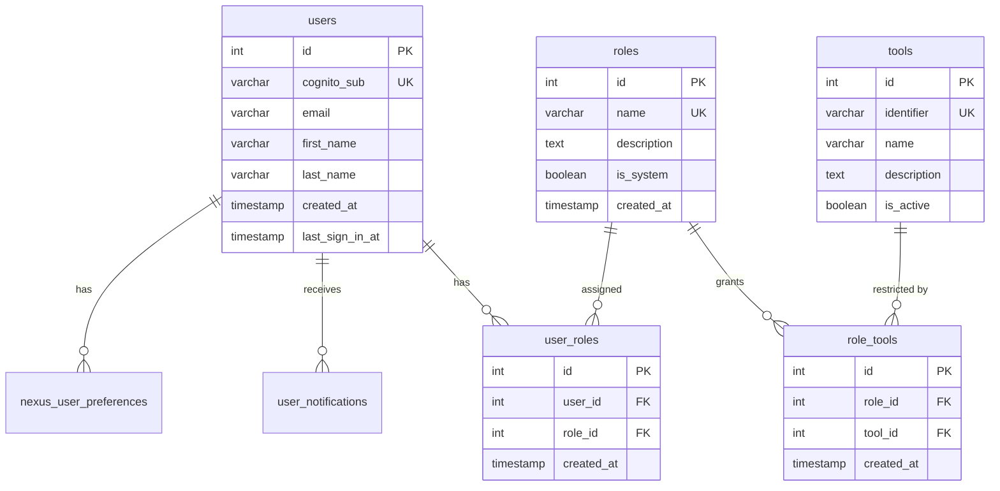

## AI Models & Configuration

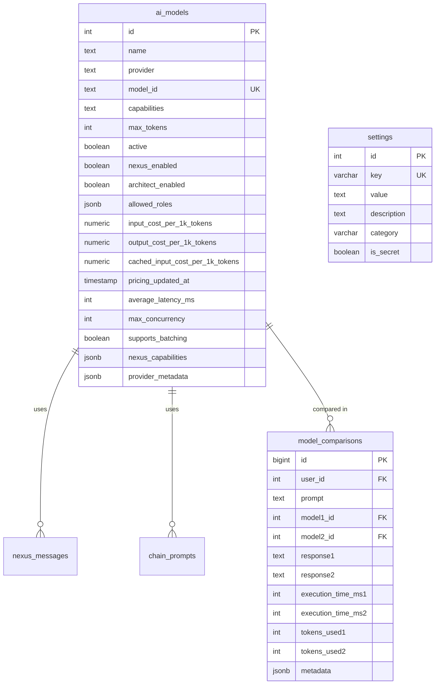

## Nexus Chat System

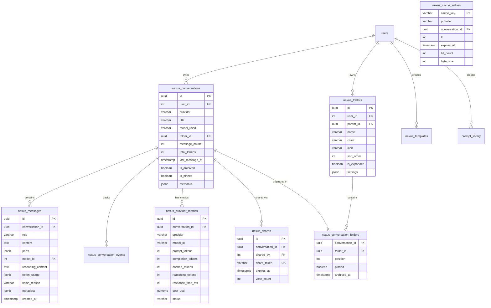

## Assistant Architect & Prompts

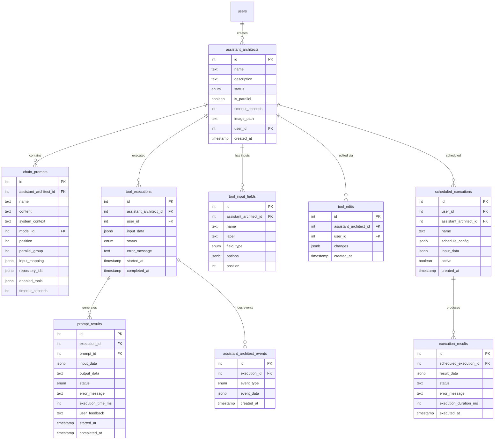

## Knowledge Repositories & Documents

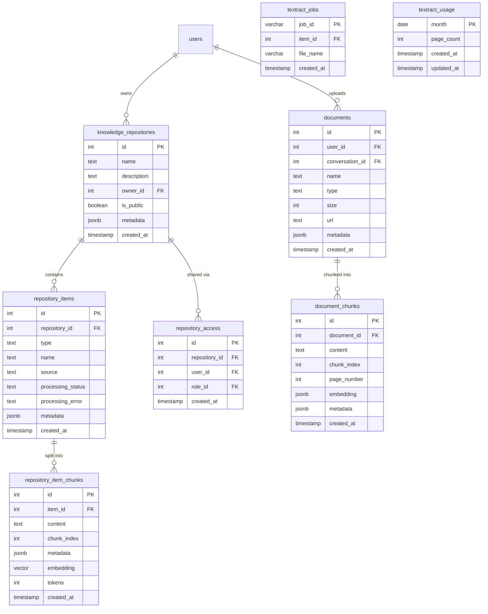

## Prompt Library & Templates

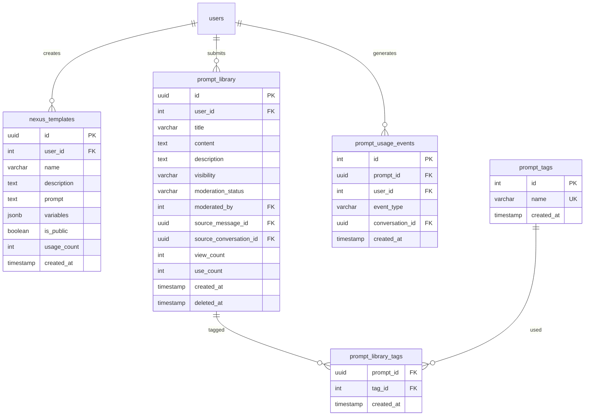

## MCP (Model Context Protocol) Integration

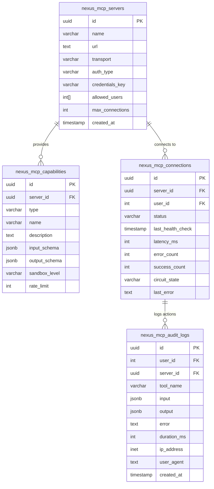

## Navigation & UI

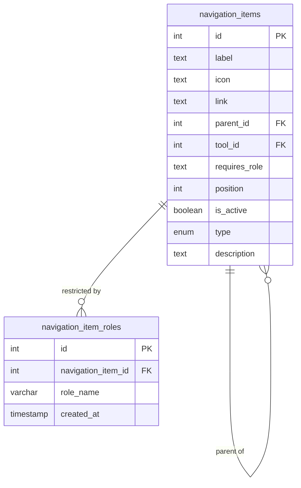

## Background Jobs & Streaming

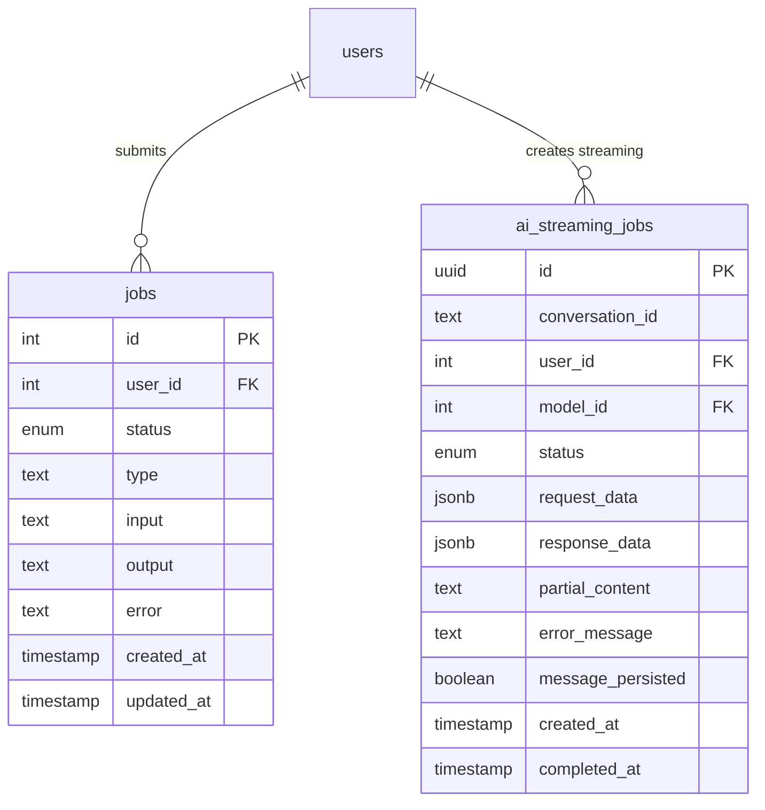

## Ideas & Voting System

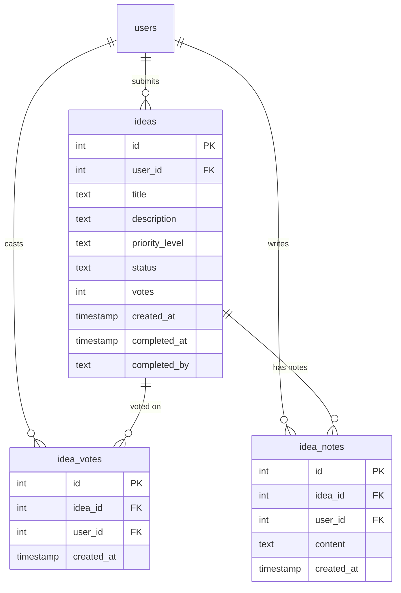

## Migration & Audit Tables

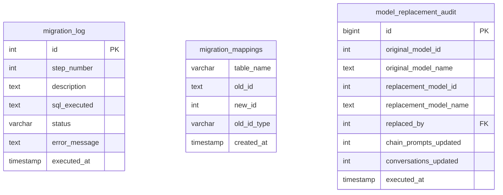

## Table Statistics

| Domain | Tables | Key Features |
|--------|--------|--------------|
| **Users & Auth** | 5 | RBAC, tool permissions |
| **Nexus Chat** | 11 | Conversations, folders, caching, metrics |
| **Assistant Architect** | 9 | Multi-prompt chains, executions, scheduling |
| **Knowledge** | 7 | Repositories, documents, embeddings (pgvector) |
| **MCP Integration** | 4 | Server registry, capabilities, audit logs |
| **Prompt Library** | 5 | Templates, tagging, usage tracking |
| **AI Models** | 3 | Multi-provider support, cost tracking |
| **Jobs & Streaming** | 2 | Async processing, real-time streaming |
| **Navigation** | 2 | Dynamic menu, role-based display |
| **Ideas** | 3 | Voting system, notes |
| **Audit/Migration** | 3 | Schema versioning, model replacements |
| **Total** | **54 tables** | **PostgreSQL 15 with pgvector extension** |

## Key Relationships

### Core Entity Dependencies
1. **users** → Central entity referenced by 30+ tables
2. **ai_models** → Referenced by conversations, messages, chain_prompts
3. **assistant_architects** → Parent of chain_prompts, tool_executions
4. **nexus_conversations** → Container for messages, metrics, shares

### Foreign Key Cascade Rules
- **User deletion**: Cascade to user_roles, preferences (retain content for audit)
- **Conversation deletion**: Cascade to messages, events, metrics
- **Repository deletion**: Cascade to items, chunks, access
- **Execution deletion**: Cascade to prompt_results, events

## Indexes

### Performance-Critical Indexes
```sql
-- User lookups
CREATE INDEX idx_users_cognito_sub ON users(cognito_sub);
CREATE INDEX idx_users_email ON users(email);

-- Conversation queries
CREATE INDEX idx_nexus_conversations_user_id ON nexus_conversations(user_id);
CREATE INDEX idx_nexus_conversations_folder_id ON nexus_conversations(folder_id);
CREATE INDEX idx_nexus_messages_conversation_id ON nexus_messages(conversation_id);

-- Vector search (pgvector)
CREATE INDEX idx_repository_item_chunks_embedding ON repository_item_chunks
  USING ivfflat (embedding vector_cosine_ops);

-- Execution tracking
CREATE INDEX idx_tool_executions_user_id ON tool_executions(user_id);
CREATE INDEX idx_tool_executions_status ON tool_executions(status);

-- Scheduled jobs
CREATE INDEX idx_scheduled_executions_active ON scheduled_executions(active);
```

## Database Features

### PostgreSQL Extensions
- **pgvector**: Vector similarity search for embeddings
- **uuid-ossp**: UUID generation for distributed IDs
- **pg_trgm**: Full-text search support

### Custom Types (ENUMs)
- `job_status`: pending, running, completed, failed
- `execution_status`: pending, running, completed, failed
- `tool_status`: draft, published, archived
- `navigation_type`: link, section, divider
- `event_type`: Various execution events

### JSONB Usage
- **Metadata**: Flexible schema for evolving features
- **Settings**: Dynamic configuration without migrations
- **Metrics**: Token usage, performance data
- **Input/Output**: Execution data, tool parameters

## Data Retention

| Table Group | Retention Policy |
|-------------|------------------|
| **User data** | Indefinite (GDPR export on request) |
| **Conversations** | 90 days archived, then user-controlled deletion |
| **Executions** | 30 days dev, 90 days prod |
| **Audit logs** | 1 year minimum |
| **Metrics** | Aggregated monthly after 90 days |
| **Cache entries** | TTL-based auto-expiry |

## Backup Strategy

- **Full backup**: Daily at 2 AM UTC
- **Point-in-time recovery**: 7 days (dev), 30 days (prod)
- **Snapshot frequency**: Hourly incremental
- **Cross-region replication**: Prod only

---

**Last Updated**: November 2025
**Total Tables**: 54
**Database Size**: ~500 MB (dev), ~5 GB (prod projected)
**PostgreSQL Version**: 15.4
**Extensions**: pgvector, uuid-ossp, pg_trgm
