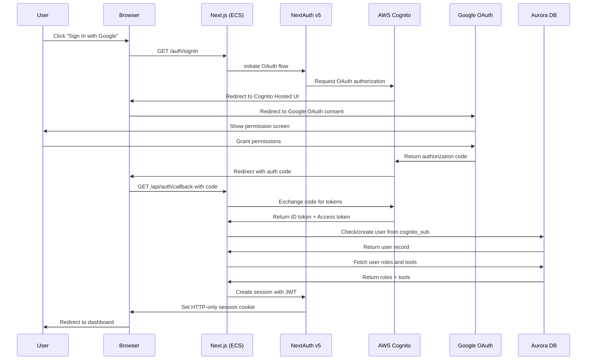
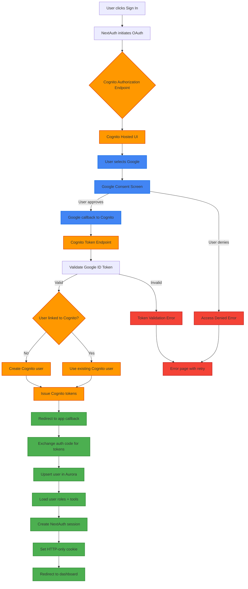
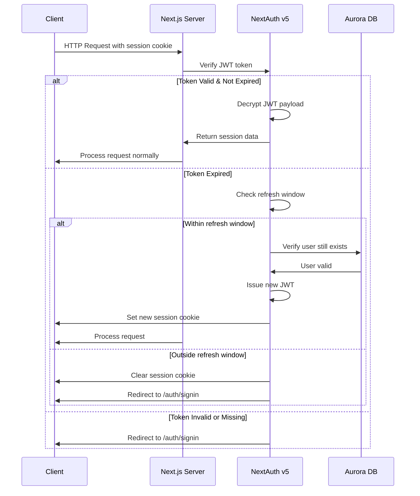
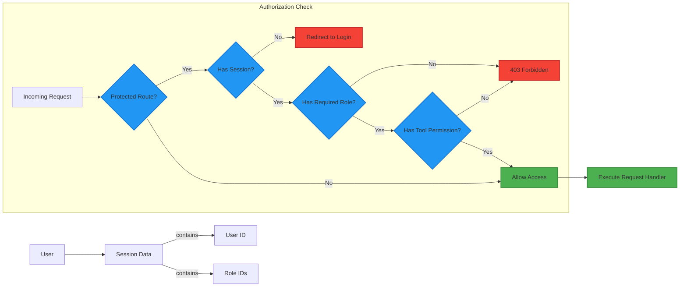
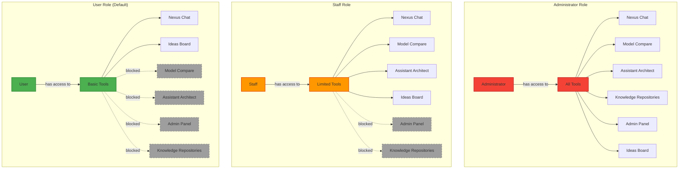
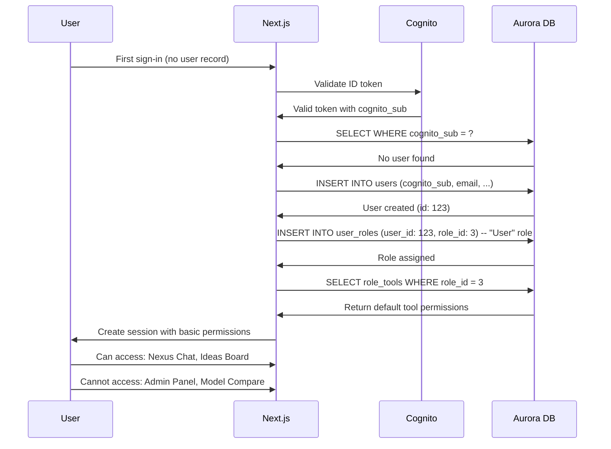

# Authentication & Authorization Flow

Complete authentication flow using AWS Cognito, Google OAuth, and NextAuth v5 with role-based access control.

## High-Level Authentication Architecture



## Detailed OAuth 2.0 Flow



## Session Management



## Role-Based Access Control (RBAC)



## Tool Permission Matrix



## Server Action Authorization

```typescript
// Example: /actions/assistant-architect.actions.ts
export async function executeAssistantArchitectAction(params) {
  const requestId = generateRequestId()
  const log = createLogger({ requestId, action: "executeAssistantArchitect" })

  try {
    // 1. Get session (includes user + roles)
    const session = await getServerSession()
    if (!session) {
      log.warn("Unauthorized - no session")
      throw ErrorFactories.authNoSession()
    }

    // 2. Check tool permission
    const hasAccess = await hasToolAccess("assistant-architect")
    if (!hasAccess) {
      log.warn("Forbidden - no tool access", {
        userId: session.user.id
      })
      throw ErrorFactories.authInsufficientPermissions()
    }

    // 3. Execute business logic
    const result = await processExecution(params)
    return createSuccess(result)

  } catch (error) {
    return handleError(error, "Execution failed", { requestId })
  }
}
```

## JWT Token Structure

```json
{
  "header": {
    "alg": "HS256",
    "typ": "JWT"
  },
  "payload": {
    "sub": "cognito-sub-uuid",
    "userId": 123,
    "email": "user@example.com",
    "name": "John Doe",
    "roles": [
      {
        "id": 1,
        "name": "administrator"
      }
    ],
    "tools": [
      "nexus-chat",
      "assistant-architect",
      "model-compare",
      "knowledge-repositories",
      "admin-panel"
    ],
    "iat": 1704067200,
    "exp": 1704153600,
    "jti": "session-uuid"
  },
  "signature": "HMACSHA256(...)"
}
```

## Session Cookie Configuration

```typescript
// /lib/auth/config.ts
export const authConfig = {
  session: {
    strategy: "jwt",
    maxAge: 30 * 24 * 60 * 60, // 30 days
    updateAge: 24 * 60 * 60,   // Update session every 24 hours
  },
  cookies: {
    sessionToken: {
      name: "__Secure-next-auth.session-token",
      options: {
        httpOnly: true,
        sameSite: "lax",
        path: "/",
        secure: true, // HTTPS only in production
      },
    },
  },
  pages: {
    signIn: "/auth/signin",
    error: "/auth/error",
  },
}
```

## First-Time User Flow



## Admin Role Grant (Manual Process)

After deploying the application, the first administrator must be granted manually:

```sql
-- 1. Find user ID by email
SELECT id, email, cognito_sub FROM users WHERE email = 'admin@example.com';

-- 2. Check/create administrator role
SELECT id FROM roles WHERE name = 'administrator';
-- If not exists:
INSERT INTO roles (name, description, is_system)
VALUES ('administrator', 'Administrator role with full access', true);

-- 3. Assign administrator role to user
INSERT INTO user_roles (user_id, role_id)
SELECT
    u.id,
    r.id
FROM users u, roles r
WHERE u.email = 'admin@example.com'
  AND r.name = 'administrator';

-- 4. Verify tool access (auto-granted via role_tools)
SELECT t.identifier, t.name
FROM tools t
JOIN role_tools rt ON t.id = rt.tool_id
JOIN roles r ON rt.role_id = r.id
WHERE r.name = 'administrator';
```

## Security Best Practices

### Implemented
- ✅ HTTP-only cookies (prevent XSS token theft)
- ✅ Secure flag in production (HTTPS only)
- ✅ SameSite=lax (CSRF protection)
- ✅ JWT expiration (30-day max)
- ✅ Server-side session validation
- ✅ Role-based tool permissions
- ✅ Database-driven authorization (not client-side)
- ✅ Cognito user pool encryption
- ✅ Google OAuth scope limitation

### Monitoring
- Failed login attempts logged to CloudWatch
- Session creation/expiry events tracked
- Permission denial audited with user context
- Cognito events forwarded to CloudWatch

### Rate Limiting (Future Enhancement)
- Login attempts: 5 per minute per IP
- Session refresh: 10 per hour per user
- Tool access checks: Cached for 5 minutes

---

**Last Updated**: November 2025
**Auth Provider**: AWS Cognito + NextAuth v5
**OAuth Providers**: Google (primary)
**Session Strategy**: JWT with HTTP-only cookies
**Session Duration**: 30 days with 24-hour refresh
