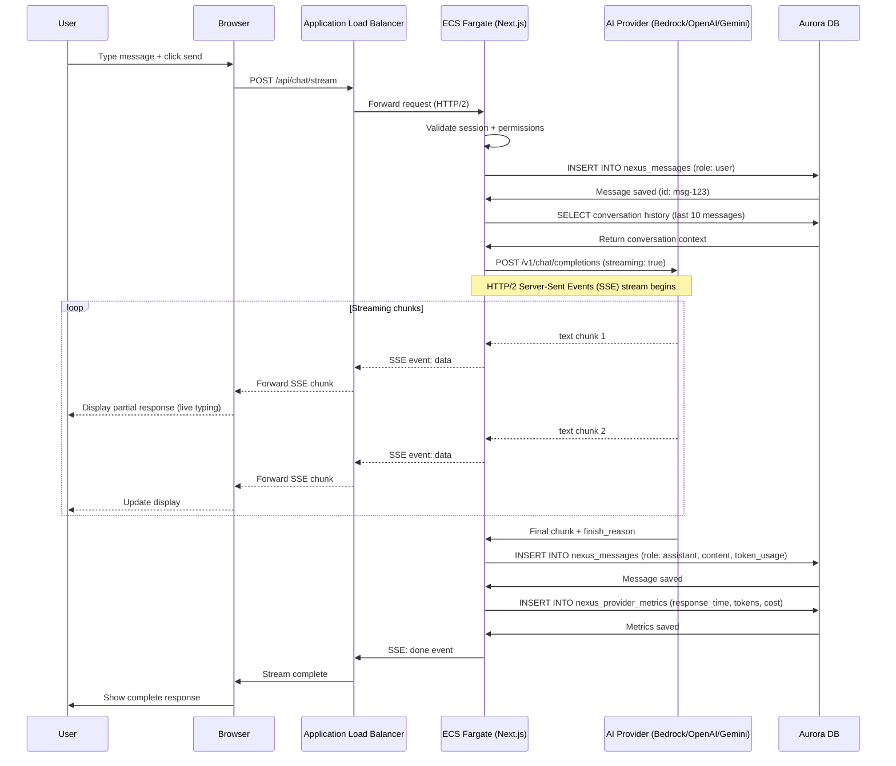
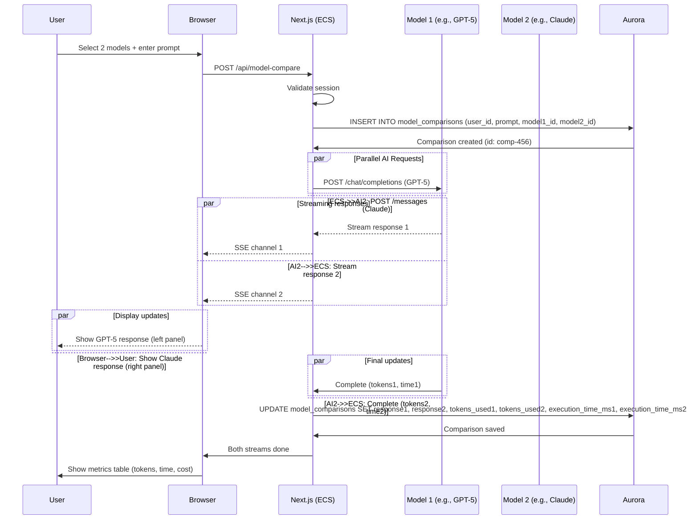
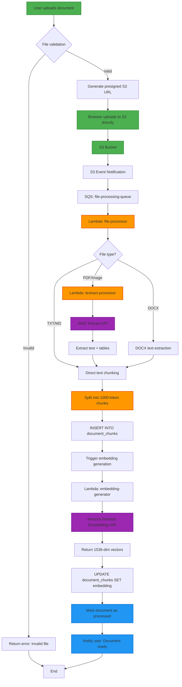
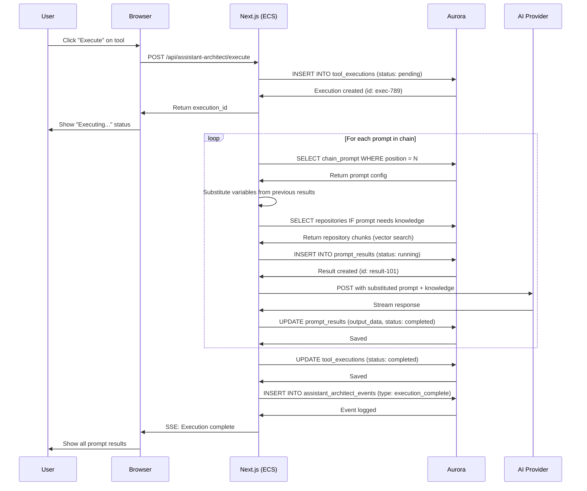
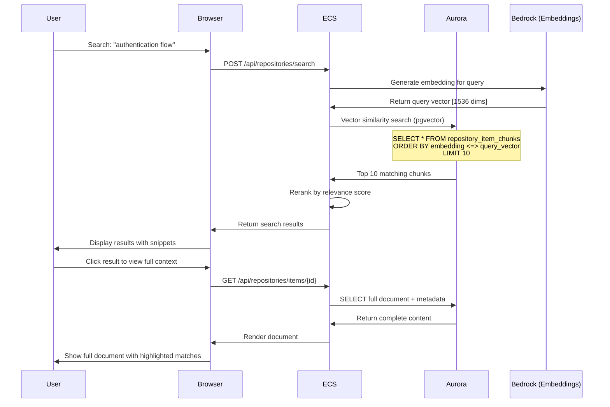
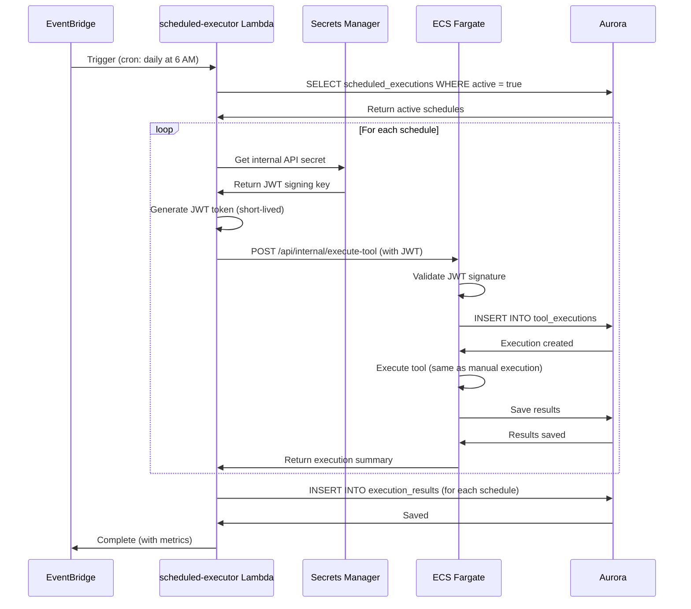
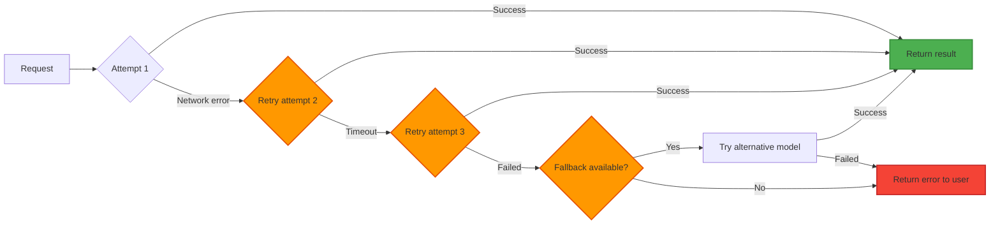

# Request Flow Diagrams

End-to-end request flows for major AI Studio features showing client → server → AI → database interactions.

## Nexus Chat - Real-Time Streaming



### Latency Breakdown
| Step | Time | Cumulative |
|------|------|------------|
| Browser → ALB | 20-30ms | 20-30ms |
| ALB → ECS routing | 2-3ms | 22-33ms |
| Session validation | 5-10ms | 27-43ms |
| Load conversation history | 10-15ms | 37-58ms |
| **Time to First Token** | **200-500ms** | **237-558ms** |
| Streaming chunks | 50-100ms each | Real-time |
| Save final message | 10-15ms | After stream |

## Model Compare - Side-by-Side Comparison



### Performance Metrics
```
Typical Execution:
├── Model 1 (GPT-5): 2.3s, 450 tokens
├── Model 2 (Claude): 1.8s, 380 tokens
└── Total time: ~2.3s (parallel execution)

Cost Comparison:
├── GPT-5: $0.0045 (450 tokens × $10/M output)
├── Claude: $0.0057 (380 tokens × $15/M output)
└── Total: $0.0102 per comparison
```

## Document Upload & Processing Pipeline



### Processing Times
| File Type | Size | Textract Time | Chunking Time | Embedding Time | Total |
|-----------|------|---------------|---------------|----------------|-------|
| **TXT** | 1 MB | 0s | 2-3s | 5-8s | **7-11s** |
| **PDF (text)** | 5 MB | 15-20s | 3-5s | 10-15s | **28-40s** |
| **PDF (scanned)** | 10 MB (100 pages) | 45-60s | 5-10s | 20-30s | **70-100s** |
| **DOCX** | 2 MB | 0s | 3-4s | 8-12s | **11-16s** |

### Cost per Document
```
Text extraction:
└── Textract: $1.50 per 1,000 pages (scanned PDFs only)

Embedding generation:
└── Bedrock Titan Embeddings: $0.0001 per 1,000 tokens
    Example: 10,000-word document (~13,000 tokens) = $0.0013

Total cost: $0.001 - $1.50 per document (depending on type)
```

## Assistant Architect Execution Flow



### Variable Substitution Example
```json
{
  "prompt_1": {
    "content": "Analyze this data: {{user_input}}",
    "result": "The data shows a 25% increase in..."
  },
  "prompt_2": {
    "content": "Based on this analysis: {{prompt_1_output}}, create recommendations",
    "substituted": "Based on this analysis: The data shows a 25% increase in..., create recommendations",
    "result": "Recommended actions: 1) Increase capacity by 30%..."
  },
  "prompt_3": {
    "content": "Summarize {{prompt_1_output}} and {{prompt_2_output}}",
    "result": "Executive summary: Analysis revealed..."
  }
}
```

## Repository Knowledge Search



### Vector Search Performance
```
Query: "how does authentication work?"
├── Embedding generation: 150-200ms
├── Vector similarity search: 50-100ms (indexed)
└── Total search time: 200-300ms

Results:
├── Top 10 chunks from 50,000+ indexed chunks
├── Relevance scores: 0.85 - 0.92 (cosine similarity)
└── Chunks span 3 different documents
```

## Scheduled Execution (EventBridge → Lambda → ECS)



### Scheduled Execution Security
- JWT tokens generated per-request with 5-minute expiry
- Internal API endpoint not exposed to public internet
- Security group restricts Lambda → ECS to specific port
- All executions logged with scheduler context

## Error Handling & Recovery

### Network Error Recovery


### Exponential Backoff Configuration
```typescript
const retryConfig = {
  maxAttempts: 3,
  baseDelay: 1000,      // 1 second
  maxDelay: 10000,      // 10 seconds
  backoffMultiplier: 2, // 1s → 2s → 4s
  jitter: true,         // Add randomness to prevent thundering herd
}
```

## Rate Limiting & Quotas

### Per-User Limits
```
Nexus Chat:
├── Requests: 100 per minute
├── Tokens: 100,000 per hour
└── Concurrent streams: 3

Model Compare:
├── Comparisons: 20 per minute
└── Concurrent executions: 2

Assistant Architect:
├── Executions: 10 per minute
├── Total prompts: 50 per hour
└── Concurrent executions: 1

Document Processing:
├── Uploads: 10 per minute
├── Max size: 10 MB per file
└── Textract pages: 100 per day (cost control)
```

### Implementation
```typescript
// Redis-based rate limiting (future enhancement)
const rateLimiter = new RateLimiter({
  windowMs: 60 * 1000,  // 1 minute window
  max: 100,              // Max requests per window
  keyGenerator: (req) => req.session.user.id,
  handler: (req, res) => {
    res.status(429).json({
      error: "Too many requests",
      retryAfter: res.getHeader("Retry-After"),
    })
  },
})
```

---

**Last Updated**: November 2025
**Streaming Protocol**: HTTP/2 Server-Sent Events (SSE)
**AI Providers**: Bedrock, OpenAI, Google AI (parallel support)
**Database**: Aurora Serverless v2 with pgvector
**Background Processing**: Lambda + SQS for async tasks
