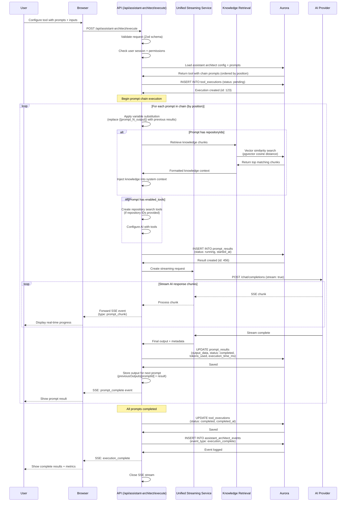
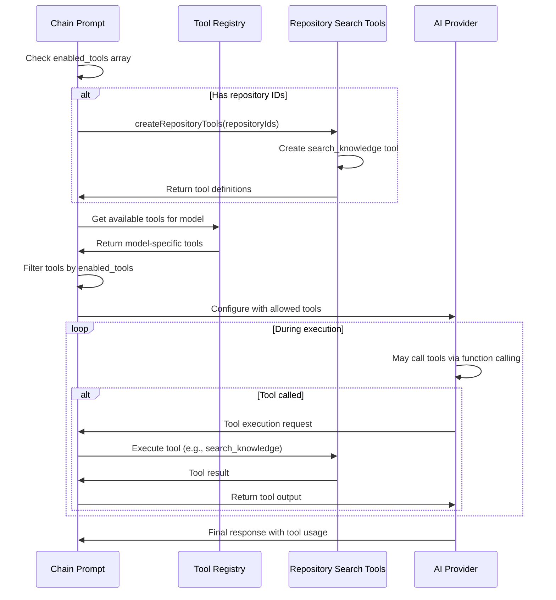

# Assistant Architect Execution Flow

Detailed flow showing how the Assistant Architect executes multi-prompt chains with variable substitution, knowledge injection, and tool integration.

## Overview

Assistant Architect enables complex, multi-step AI workflows by:
- Chaining multiple prompts sequentially
- Substituting outputs from previous prompts as inputs to later prompts
- Injecting relevant knowledge from repositories (vector/keyword/hybrid search)
- Enabling per-prompt tool configurations
- Streaming real-time execution progress via Server-Sent Events (SSE)

## Complete Execution Flow



## Variable Substitution Engine

### Pattern Matching

```typescript
// Variables follow pattern: {{variable_name}}
// Supported variables:
// - {{user_input}} - Original user inputs
// - {{prompt_N_output}} - Output from prompt at position N
// - {{repository_search}} - Knowledge search results

const VARIABLE_PATTERN = /\{\{([^}]+)\}\}/g;
const MAX_VARIABLE_REPLACEMENTS = 50; // DoS protection
```

### Substitution Example

```json
{
  "prompts": [
    {
      "position": 1,
      "content": "Analyze this data: {{user_input}}",
      "output": "The data shows a 25% increase in user engagement..."
    },
    {
      "position": 2,
      "content": "Based on {{prompt_1_output}}, create recommendations",
      "substituted_content": "Based on 'The data shows a 25% increase...', create recommendations",
      "output": "Recommended actions:\n1. Increase capacity by 30%\n2. Add monitoring..."
    },
    {
      "position": 3,
      "content": "Summarize findings from {{prompt_1_output}} and {{prompt_2_output}}",
      "substituted_content": "Summarize findings from 'The data shows...' and 'Recommended actions...'",
      "output": "Executive Summary: Analysis revealed 25% growth..."
    }
  ]
}
```

## Knowledge Injection Flow

```mermaid
graph TB
    PROMPT[Chain Prompt] --> CHECK_REPOS{Has repositoryIds?}
    CHECK_REPOS -->|No| EXECUTE[Execute without knowledge]
    CHECK_REPOS -->|Yes| RETRIEVE[Retrieve knowledge chunks]

    RETRIEVE --> SEARCH_TYPE{Search strategy}
    SEARCH_TYPE -->|Vector| VECTOR[pgvector cosine similarity]
    SEARCH_TYPE -->|Keyword| KEYWORD[Full-text search]
    SEARCH_TYPE -->|Hybrid| HYBRID[Combined scoring]

    VECTOR --> RANK[Rank by relevance score]
    KEYWORD --> RANK
    HYBRID --> RANK

    RANK --> TOP_K[Select top K chunks<br/>(default: 5)]
    TOP_K --> FORMAT[Format as context]

    FORMAT --> INJECT[Inject into system context]
    INJECT --> EXECUTE_WITH_KNOWLEDGE[Execute with knowledge]

    EXECUTE --> RESULT[AI Response]
    EXECUTE_WITH_KNOWLEDGE --> RESULT

    classDef search fill:#e1f5ff,stroke:#1976d2,stroke-width:2px
    classDef process fill:#fff9c4,stroke:#f57f17,stroke-width:2px
    classDef output fill:#c8e6c9,stroke:#388e3c,stroke-width:2px

    class VECTOR,KEYWORD,HYBRID search
    class RANK,TOP_K,FORMAT,INJECT process
    class RESULT output
```

### Knowledge Context Format

```typescript
// Formatted knowledge injected into system context
const knowledgeContext = `
**Relevant Knowledge:**

**Document 1:** "Architecture Overview" (relevance: 0.92)
> The AI Studio application uses ECS Fargate for hosting with Application Load Balancer...

**Document 2:** "Database Schema" (relevance: 0.87)
> PostgreSQL with pgvector extension enables vector similarity search...

**Document 3:** "Authentication Flow" (relevance: 0.85)
> OAuth 2.0 via AWS Cognito with Google federation...
`;
```

## Tool Integration



### Supported Tools

```typescript
// Per-prompt tool configuration
interface ChainPrompt {
  enabled_tools: string[] | null;  // null = all tools, [] = no tools
}

// Available tool categories:
// 1. Repository search (auto-created if repositoryIds present)
const repositoryTools = {
  search_knowledge: {
    description: "Search knowledge repositories for relevant information",
    parameters: {
      query: "string",
      max_results: "number (default: 5)"
    }
  }
};

// 2. Built-in tools (from tool-registry)
// - web_search
// - code_interpreter
// - image_analysis
// - ...
```

## Streaming Event Types

```typescript
// SSE events sent during execution
type ExecutionEvent =
  | { type: 'execution_started'; data: { executionId: number; totalPrompts: number } }
  | { type: 'prompt_started'; data: { promptId: number; position: number; name: string } }
  | { type: 'prompt_chunk'; data: { promptId: number; content: string } }
  | { type: 'prompt_complete'; data: { promptId: number; output: string; metadata: PromptMetadata } }
  | { type: 'execution_complete'; data: { executionId: number; totalTime: number; results: PromptResult[] } }
  | { type: 'error'; data: { message: string; promptId?: number } };

interface PromptMetadata {
  tokens_used: number;
  execution_time_ms: number;
  model_id: number;
  knowledge_chunks_used?: number;
  tools_called?: string[];
}
```

## Error Handling & Rollback

```mermaid
graph TB
    START[Execution Started] --> PROMPT1[Execute Prompt 1]
    PROMPT1 -->|Success| SAVE1[Save result to DB]
    SAVE1 --> PROMPT2[Execute Prompt 2]
    PROMPT2 -->|Success| SAVE2[Save result to DB]
    SAVE2 --> PROMPT3[Execute Prompt 3]
    PROMPT3 -->|Error| ERROR[Execution failed]

    ERROR --> MARK_FAILED[UPDATE tool_executions<br/>SET status = 'failed']
    MARK_FAILED --> PARTIAL_RESULTS[Partial results preserved<br/>(prompt_results still available)]

    PROMPT3 -->|Success| SAVE3[Save result to DB]
    SAVE3 --> COMPLETE[Mark execution completed]

    PROMPT1 -->|Error| ERROR
    PROMPT2 -->|Error| ERROR

    classDef success fill:#c8e6c9,stroke:#388e3c,stroke-width:2px
    classDef error fill:#ffcccc,stroke:#c62828,stroke-width:2px
    classDef partial fill:#fff9c4,stroke:#f57f17,stroke-width:2px

    class SAVE1,SAVE2,SAVE3,COMPLETE success
    class ERROR,MARK_FAILED error
    class PARTIAL_RESULTS partial
```

### Error Recovery Strategy

- **Partial results preserved**: Even if prompt 3 fails, prompts 1 and 2 results remain in database
- **Execution status tracking**: `tool_executions.status` = 'failed' with `error_message`
- **No automatic retry**: User must manually retry execution
- **Error propagation**: Client receives SSE error event with details

## Resource Limits

```typescript
// DoS protection limits
const RESOURCE_LIMITS = {
  MAX_INPUT_SIZE_BYTES: 100000,          // 100KB max user inputs
  MAX_INPUT_FIELDS: 50,                   // Max 50 input fields
  MAX_PROMPT_CHAIN_LENGTH: 20,            // Max 20 prompts per tool
  MAX_PROMPT_CONTENT_SIZE: 10000000,      // 10MB max prompt content
  MAX_VARIABLE_REPLACEMENTS: 50,          // Max 50 {{variables}} per prompt
  MAX_DURATION_SECONDS: 900,              // 15 minutes max execution time
  MAX_KNOWLEDGE_CHUNKS: 10,               // Max knowledge chunks per prompt
  MAX_TOOLS_PER_PROMPT: 10,               // Max enabled tools per prompt
};
```

## Performance Metrics

### Typical Execution Times

```
Simple 3-Prompt Chain (No knowledge, no tools):
├── Prompt 1: 2.3s (450 tokens)
├── Prompt 2: 1.8s (380 tokens)
├── Prompt 3: 2.1s (420 tokens)
└── Total: ~6.2s + database overhead (~200ms) = 6.4s

Complex 5-Prompt Chain (With knowledge + tools):
├── Prompt 1 (with 3 knowledge chunks): 3.5s (650 tokens)
├── Prompt 2 (with tool call): 5.2s (480 tokens + tool execution)
├── Prompt 3 (with 5 knowledge chunks): 4.1s (720 tokens)
├── Prompt 4 (simple): 1.9s (350 tokens)
├── Prompt 5 (summary): 2.8s (500 tokens)
└── Total: ~17.5s + database/search overhead (~800ms) = 18.3s
```

### Cost Analysis

```
Example: 5-prompt workflow
├── Prompt 1: 650 tokens × $10/M (GPT-5) = $0.0065
├── Prompt 2: 480 tokens × $10/M = $0.0048
├── Prompt 3: 720 tokens × $10/M = $0.0072
├── Prompt 4: 350 tokens × $10/M = $0.0035
├── Prompt 5: 500 tokens × $10/M = $0.0050
├── Knowledge search (Bedrock embeddings): ~$0.0002
└── Total cost: ~$0.027 per execution
```

## Database Schema

### Core Tables

```sql
-- tool_executions: Track overall execution
CREATE TABLE tool_executions (
    id SERIAL PRIMARY KEY,
    assistant_architect_id INT NOT NULL,
    user_id INT NOT NULL,
    input_data JSONB,              -- User inputs
    status VARCHAR(20),             -- pending, running, completed, failed
    error_message TEXT,
    started_at TIMESTAMP,
    completed_at TIMESTAMP,
    FOREIGN KEY (assistant_architect_id) REFERENCES assistant_architects(id),
    FOREIGN KEY (user_id) REFERENCES users(id)
);

-- prompt_results: Individual prompt execution results
CREATE TABLE prompt_results (
    id SERIAL PRIMARY KEY,
    execution_id INT NOT NULL,
    prompt_id INT NOT NULL,
    input_data JSONB,              -- Substituted prompt content
    output_data TEXT,               -- AI response
    status VARCHAR(20),
    error_message TEXT,
    execution_time_ms INT,
    tokens_used INT,
    model_id INT,
    started_at TIMESTAMP,
    completed_at TIMESTAMP,
    FOREIGN KEY (execution_id) REFERENCES tool_executions(id) ON DELETE CASCADE,
    FOREIGN KEY (prompt_id) REFERENCES chain_prompts(id)
);

-- assistant_architect_events: Audit trail
CREATE TABLE assistant_architect_events (
    id SERIAL PRIMARY KEY,
    execution_id INT NOT NULL,
    event_type VARCHAR(50),        -- execution_started, prompt_completed, etc.
    event_data JSONB,
    created_at TIMESTAMP DEFAULT NOW(),
    FOREIGN KEY (execution_id) REFERENCES tool_executions(id) ON DELETE CASCADE
);
```

## Client-Side Integration

### React Hook Usage

```typescript
import { useAssistantArchitectExecution } from '@/hooks/use-assistant-architect-execution';

function AssistantArchitectPanel() {
  const {
    execute,
    isExecuting,
    currentPrompt,
    results,
    error
  } = useAssistantArchitectExecution();

  const handleExecute = async () => {
    await execute({
      toolId: 42,
      inputs: { user_input: "Analyze Q4 sales data" }
    });
  };

  return (
    <div>
      <button onClick={handleExecute} disabled={isExecuting}>
        Execute
      </button>

      {isExecuting && (
        <div>Running prompt {currentPrompt.position}/{results.totalPrompts}...</div>
      )}

      {results.map(result => (
        <PromptResultCard key={result.promptId} result={result} />
      ))}
    </div>
  );
}
```

## Security Considerations

### Access Control

- **Tool access permission**: User must have `assistant-architect` tool permission
- **Repository access**: Knowledge injection only includes repositories user has access to
- **Owner validation**: For private tools, validates user is owner or has shared access

### Input Validation

```typescript
// Zod schema validation
const ExecuteRequestSchema = z.object({
  toolId: z.number().positive(),
  inputs: z.record(z.string(), z.unknown())
    .refine(
      (inputs) => JSON.stringify(inputs).length <= MAX_INPUT_SIZE_BYTES,
      { message: "Input data too large" }
    )
    .refine(
      (inputs) => Object.keys(inputs).length <= MAX_INPUT_FIELDS,
      { message: "Too many input fields" }
    )
});
```

### Content Safety

- **SQL injection prevention**: Parameterized queries for all database operations
- **XSS prevention**: All user inputs sanitized before rendering
- **DoS protection**: Resource limits on chain length, variable replacements, execution time

---

**Last Updated**: November 2025
**API Endpoint**: `/api/assistant-architect/execute`
**Streaming Protocol**: Server-Sent Events (SSE)
**Max Execution Time**: 15 minutes (900 seconds)
**Database Persistence**: All prompt results stored with metadata
