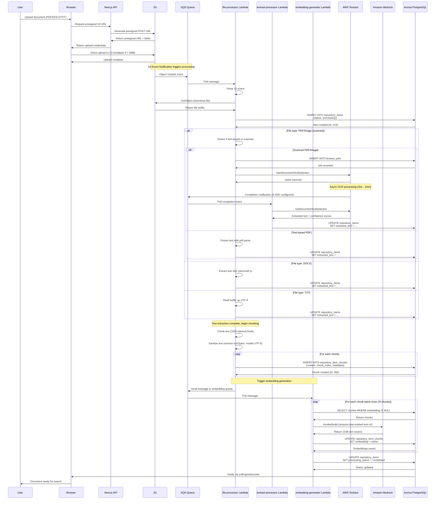
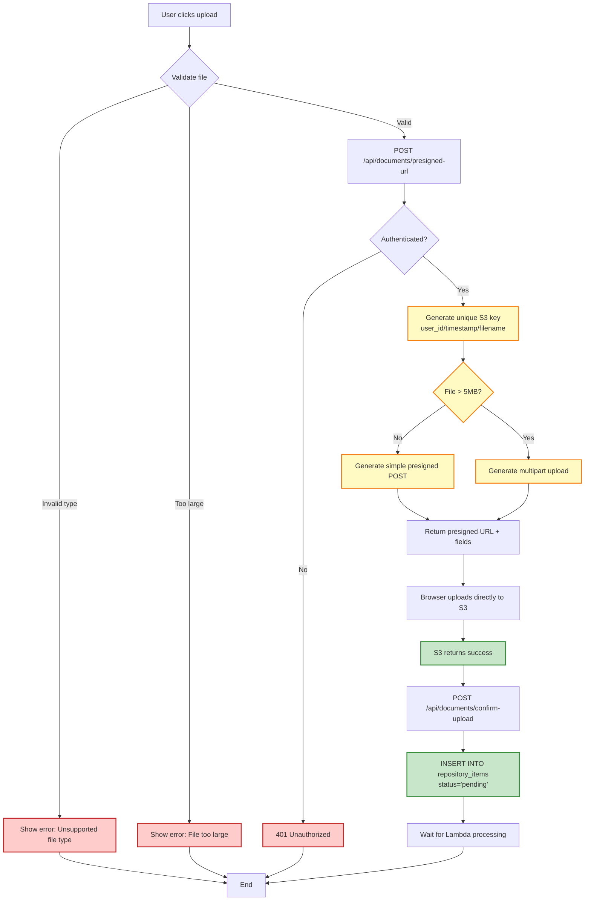
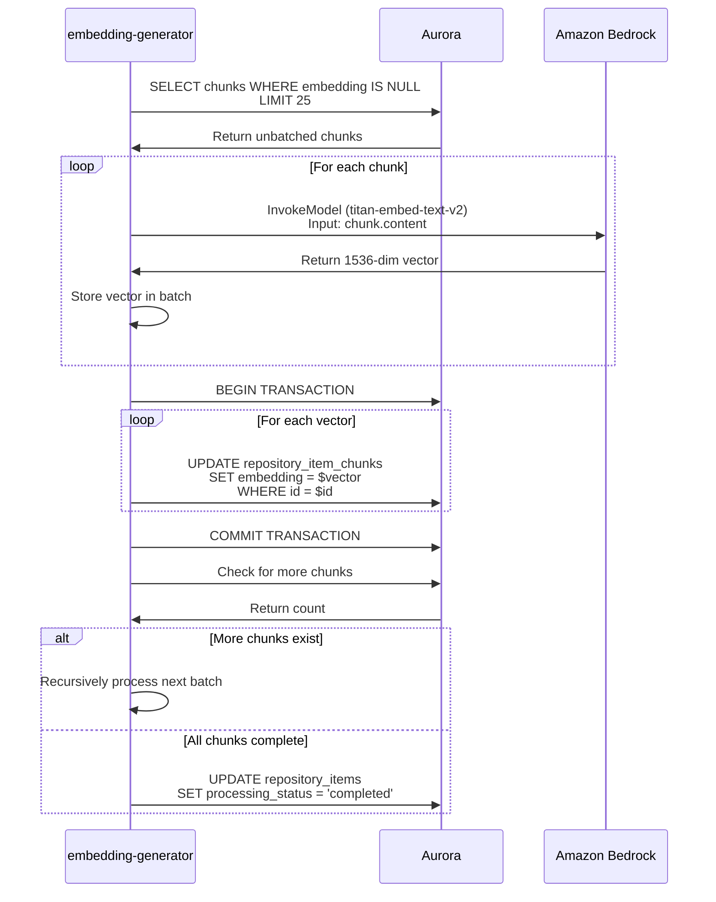
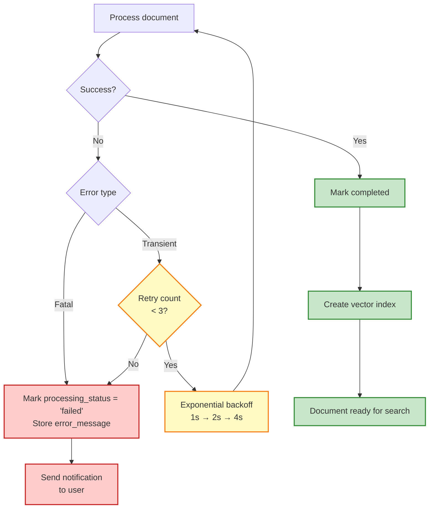

# Document Processing Pipeline

Complete asynchronous document processing flow from upload → S3 → Lambda → Textract → Embedding → PostgreSQL with pgvector.

## Overview

The document processing pipeline handles:
- Multi-format document uploads (PDF, DOCX, TXT, URLs)
- Async processing via Lambda + SQS queuing
- OCR via AWS Textract for scanned documents
- Text chunking for optimal embedding
- Vector embedding generation via Amazon Bedrock
- Storage in PostgreSQL with pgvector for similarity search

## Complete Processing Flow



## File Upload Flow (S3 Presigned URL)



## Text Extraction Methods

### PDF Processing

```typescript
// Text-based PDF (fast path)
import pdfParse from 'pdf-parse/lib/pdf-parse.js';

const result = await pdfParse(buffer);
const text = result.text;
const metadata = {
  pageCount: result.numpages,
  info: result.info
};

// Scanned PDF (OCR path via Textract)
const textractClient = new TextractClient({});
const command = new StartDocumentTextDetectionCommand({
  DocumentLocation: {
    S3Object: {
      Bucket: bucket,
      Name: key
    }
  },
  NotificationChannel: {
    SNSTopicArn: snsTopicArn,
    RoleArn: textractRoleArn
  }
});

const { JobId } = await textractClient.send(command);

// Later, retrieve results
const getCommand = new GetDocumentTextDetectionCommand({ JobId });
const { Blocks } = await textractClient.send(getCommand);

const extractedText = Blocks
  .filter(block => block.BlockType === 'LINE')
  .map(block => block.Text)
  .join('\n');
```

### DOCX Processing

```typescript
import mammoth from 'mammoth';

const result = await mammoth.extractRawText({ buffer });
const text = result.value;
const metadata = {
  messages: result.messages  // Warnings about unsupported features
};
```

### TXT Processing

```typescript
const text = buffer.toString('utf-8');

// Sanitize to remove null bytes and invalid UTF-8
const sanitized = sanitizeTextWithMetrics(text);
```

## Text Chunking Strategy

```mermaid
graph TB
    TEXT[Extracted Text] --> SANITIZE[Sanitize text<br/>Remove null bytes, invalid UTF-8]
    SANITIZE --> SPLIT_PARA[Split by paragraph<br/>(double newline)]

    SPLIT_PARA --> INIT_CHUNK[Initialize chunk buffer]

    LOOP_START[For each paragraph] --> CHECK_SIZE{Chunk + para<br/>< maxSize?}
    CHECK_SIZE -->|Yes| ADD_PARA[Add paragraph to chunk]
    CHECK_SIZE -->|No| SAVE_CHUNK[Save current chunk]

    ADD_PARA --> NEXT_PARA[Next paragraph]
    SAVE_CHUNK --> START_NEW[Start new chunk with paragraph]
    START_NEW --> NEXT_PARA

    NEXT_PARA --> MORE{More paragraphs?}
    MORE -->|Yes| LOOP_START
    MORE -->|No| FINAL_CHUNK[Save final chunk]

    FINAL_CHUNK --> CHUNKS[Array of chunks]

    classDef process fill:#fff9c4,stroke:#f57f17,stroke-width:2px
    classDef output fill:#c8e6c9,stroke:#388e3c,stroke-width:2px

    class SANITIZE,SPLIT_PARA,ADD_PARA,SAVE_CHUNK,START_NEW process
    class CHUNKS output
```

### Chunking Algorithm

```typescript
export function chunkText(text: string, maxChunkSize: number = 1000): string[] {
  const paragraphs = text.split(/\n\s*\n/);
  const chunks: string[] = [];
  let currentChunk = '';

  for (const paragraph of paragraphs) {
    if (currentChunk.length + paragraph.length <= maxChunkSize) {
      currentChunk += paragraph + '\n\n';
    } else {
      if (currentChunk) chunks.push(currentChunk.trim());
      currentChunk = paragraph + '\n\n';
    }
  }

  if (currentChunk) chunks.push(currentChunk.trim());
  return chunks;
}
```

## Embedding Generation



### Bedrock Embedding Request

```typescript
import { BedrockRuntimeClient, InvokeModelCommand } from '@aws-sdk/client-bedrock-runtime';

const client = new BedrockRuntimeClient({});

const requestBody = {
  inputText: chunkContent,
  dimensions: 1536,
  normalize: true
};

const command = new InvokeModelCommand({
  modelId: 'amazon.titan-embed-text-v2:0',
  contentType: 'application/json',
  accept: 'application/json',
  body: JSON.stringify(requestBody)
});

const response = await client.send(command);
const result = JSON.parse(new TextDecoder().decode(response.body));
const embedding = result.embedding;  // Float32Array of 1536 dimensions
```

## Vector Search (pgvector)

```sql
-- Create vector extension
CREATE EXTENSION IF NOT EXISTS vector;

-- Add vector column to chunks table
ALTER TABLE repository_item_chunks
ADD COLUMN embedding vector(1536);

-- Create HNSW index for fast similarity search
CREATE INDEX idx_repository_item_chunks_embedding
ON repository_item_chunks
USING hnsw (embedding vector_cosine_ops);

-- Similarity search query
SELECT
    c.id,
    c.content,
    r.name AS repository_name,
    1 - (c.embedding <=> $query_vector) AS similarity
FROM repository_item_chunks c
JOIN repository_items i ON c.item_id = i.id
JOIN knowledge_repositories r ON i.repository_id = r.id
WHERE i.repository_id = ANY($repository_ids)
  AND (1 - (c.embedding <=> $query_vector)) > $threshold
ORDER BY c.embedding <=> $query_vector
LIMIT $top_k;
```

## Processing Times & Costs

### Processing Time Breakdown

| File Type | Size | Textract | Extraction | Chunking | Embedding | Total Time |
|-----------|------|----------|------------|----------|-----------|------------|
| **TXT** | 100 KB | 0s | 0.1s | 0.5s | 2s | **2.6s** |
| **DOCX** | 500 KB | 0s | 1.2s | 1.5s | 5s | **7.7s** |
| **PDF (text)** | 2 MB | 0s | 3s | 2s | 10s | **15s** |
| **PDF (scanned)** | 5 MB (50 pages) | 45s | 0s | 3s | 15s | **63s** |
| **Large PDF** | 50 MB (500 pages) | 180s | 15s | 8s | 60s | **263s** |

### Cost per Document

```
Text extraction:
├── PDF text-based: $0 (pdf-parse library)
├── DOCX: $0 (mammoth.js library)
├── TXT: $0 (native Node.js)
└── PDF scanned (Textract): $1.50 per 1,000 pages
    Example: 100-page scanned PDF = $0.15

Embedding generation (Bedrock Titan Embeddings):
├── Cost: $0.0001 per 1,000 tokens
├── Example: 10,000-word document (~13,000 tokens) = $0.0013
└── Large document: 100,000 words (~130,000 tokens) = $0.013

Storage (PostgreSQL with pgvector):
├── Vector storage: ~6 KB per 1536-dim embedding
├── 1,000 chunks = ~6 MB storage
└── Aurora storage: $0.10/GB/month → $0.0006/month for 1,000 chunks

Total cost per document:
├── Small text document (TXT/DOCX): $0.001 - $0.002
├── Medium PDF (text): $0.005 - $0.01
└── Large scanned PDF (100 pages): $0.15 - $0.17
```

## Lambda Configuration

### file-processor

```typescript
{
  runtime: 'nodejs20.x',
  memorySize: 1024,  // Based on PowerTuning results
  timeout: 300,      // 5 minutes for large files
  environment: {
    BUCKET_NAME: documentBucket.bucketName,
    TEXTRACT_SNS_TOPIC_ARN: textractTopic.topicArn,
    EMBEDDING_QUEUE_URL: embeddingQueue.queueUrl
  },
  reservedConcurrentExecutions: 10  // Limit parallel processing
}
```

### textract-processor

```typescript
{
  runtime: 'nodejs20.x',
  memorySize: 512,   // Lightweight
  timeout: 600,      // 10 minutes for large OCR jobs
  environment: {
    TEXTRACT_ROLE_ARN: textractRole.roleArn
  }
}
```

### embedding-generator

```typescript
{
  runtime: 'nodejs20.x',
  memorySize: 1024,
  timeout: 300,
  environment: {
    BEDROCK_MODEL_ID: 'amazon.titan-embed-text-v2:0',
    BATCH_SIZE: '25'
  },
  reservedConcurrentExecutions: 5  // Bedrock throttling protection
}
```

## Error Handling & Retry Logic



### SQS Dead Letter Queue

```typescript
const processingQueue = new Queue(this, 'DocumentProcessingQueue', {
  visibilityTimeout: Duration.minutes(6),
  retentionPeriod: Duration.days(14),
  receiveMessageWaitTime: Duration.seconds(20),
  deadLetterQueue: {
    queue: deadLetterQueue,
    maxReceiveCount: 3  // After 3 failures, move to DLQ
  }
});
```

## Database Schema

```sql
-- repository_items: Document metadata
CREATE TABLE repository_items (
    id SERIAL PRIMARY KEY,
    repository_id INT NOT NULL,
    type VARCHAR(50),                    -- 'document', 'url', 'text'
    name VARCHAR(255),
    source TEXT,                         -- S3 key or URL
    processing_status VARCHAR(20),       -- pending, processing, completed, failed
    processing_error TEXT,
    metadata JSONB,
    created_at TIMESTAMP DEFAULT NOW(),
    FOREIGN KEY (repository_id) REFERENCES knowledge_repositories(id) ON DELETE CASCADE
);

-- repository_item_chunks: Chunked content with embeddings
CREATE TABLE repository_item_chunks (
    id SERIAL PRIMARY KEY,
    item_id INT NOT NULL,
    content TEXT NOT NULL,
    chunk_index INT NOT NULL,
    metadata JSONB,
    embedding vector(1536),              -- pgvector type
    tokens INT,
    created_at TIMESTAMP DEFAULT NOW(),
    FOREIGN KEY (item_id) REFERENCES repository_items(id) ON DELETE CASCADE
);

-- textract_jobs: Track OCR jobs
CREATE TABLE textract_jobs (
    job_id VARCHAR(255) PRIMARY KEY,
    item_id INT NOT NULL,
    file_name VARCHAR(255),
    created_at TIMESTAMP DEFAULT NOW(),
    FOREIGN KEY (item_id) REFERENCES repository_items(id) ON DELETE CASCADE
);

-- Indexes
CREATE INDEX idx_repository_items_status ON repository_items(processing_status);
CREATE INDEX idx_repository_items_repository_id ON repository_items(repository_id);
CREATE INDEX idx_repository_item_chunks_item_id ON repository_item_chunks(item_id);
CREATE INDEX idx_repository_item_chunks_embedding ON repository_item_chunks
  USING hnsw (embedding vector_cosine_ops);
```

## Monitoring & Observability

### CloudWatch Metrics

```typescript
// Custom metrics published by Lambda
const metrics = {
  DocumentsProcessed: new MetricFilter({
    metricName: 'DocumentsProcessed',
    metricNamespace: 'AIStudio/DocumentProcessing',
    filterPattern: FilterPattern.literal('[status = completed]')
  }),

  ProcessingDuration: new Metric({
    metricName: 'ProcessingDuration',
    namespace: 'AIStudio/DocumentProcessing',
    statistic: 'Average',
    unit: 'Milliseconds'
  }),

  TextractPages: new Metric({
    metricName: 'TextractPagesProcessed',
    namespace: 'AIStudio/DocumentProcessing',
    statistic: 'Sum'
  }),

  EmbeddingTokens: new Metric({
    metricName: 'EmbeddingTokensGenerated',
    namespace: 'AIStudio/DocumentProcessing',
    statistic: 'Sum'
  })
};
```

### CloudWatch Alarms

- **High error rate**: > 10% of documents fail processing
- **DLQ depth**: > 5 messages in dead letter queue
- **Processing latency**: > 5 minutes for standard documents
- **Textract quota**: Approaching 100 pages/day limit (cost control)

---

**Last Updated**: November 2025
**Supported Formats**: PDF, DOCX, TXT (PPT planned)
**Max File Size**: 10 MB (configurable up to 100 MB)
**Vector Dimensions**: 1536 (Titan Embeddings v2)
**Database**: PostgreSQL 15 with pgvector extension
