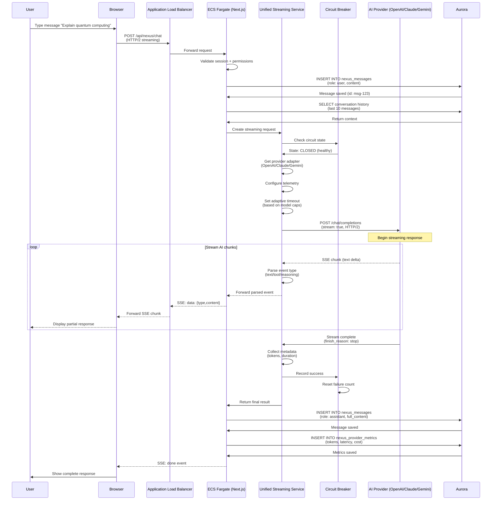
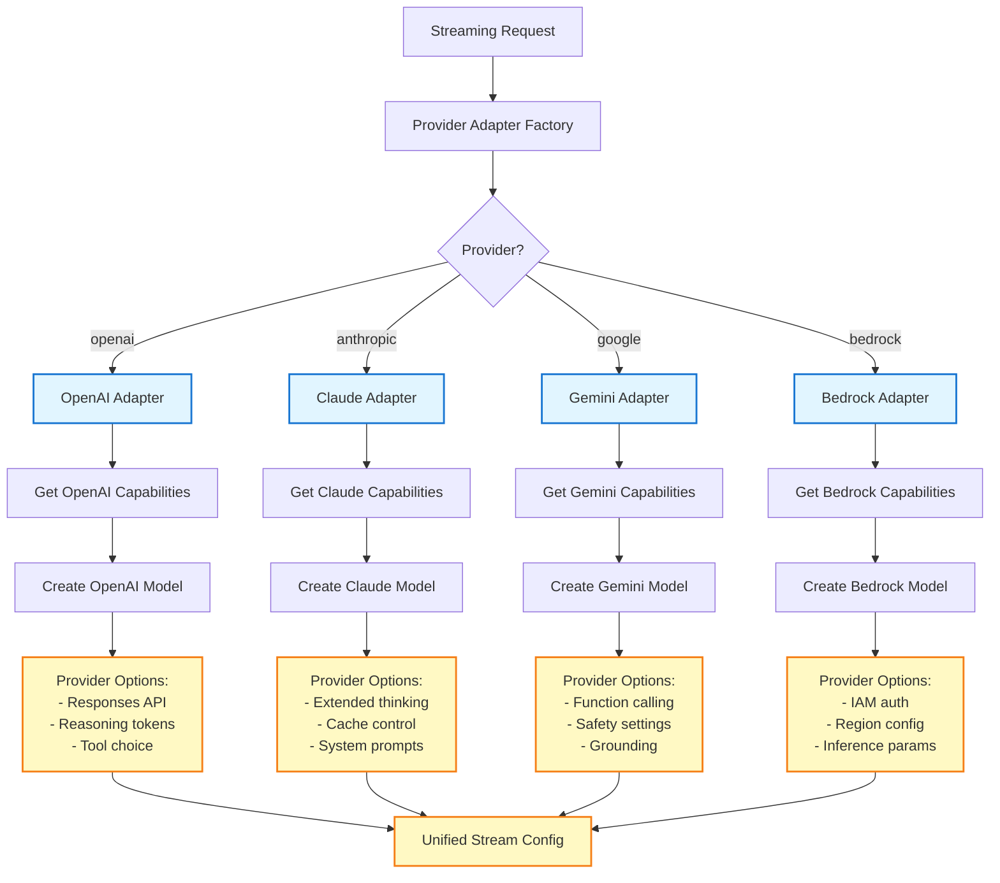
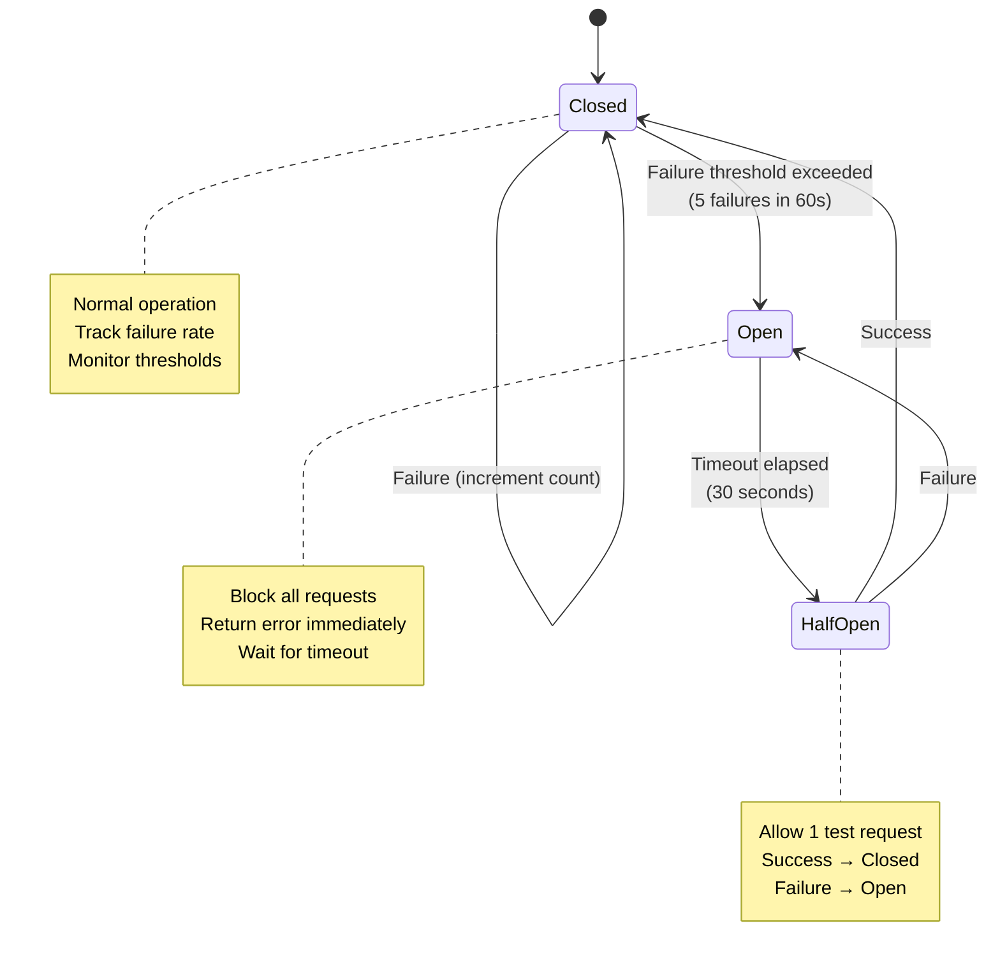
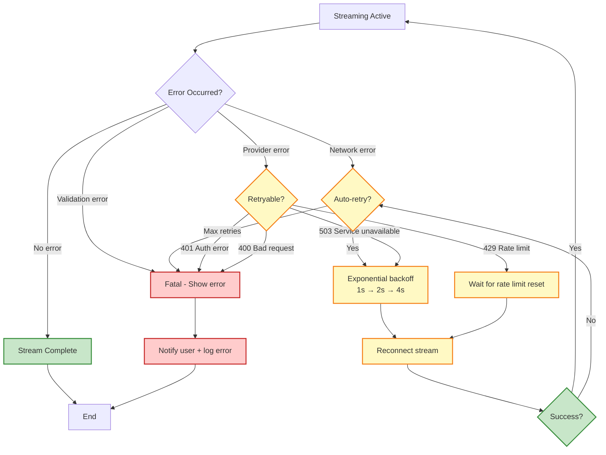

# Streaming Architecture

Server-Sent Events (SSE) architecture for real-time AI responses via HTTP/2 with ECS Fargate, Application Load Balancer, and Next.js 15.

## Overview

The AI Studio streaming architecture enables:
- Real-time AI response streaming via Server-Sent Events (SSE)
- Multi-provider support (OpenAI, Claude, Gemini, Bedrock)
- Provider-specific optimizations (Responses API, thinking modes)
- Circuit breaker pattern for reliability
- Adaptive timeouts based on model capabilities
- Comprehensive telemetry and observability

## Complete Streaming Flow



## HTTP/2 Configuration

### ALB Settings

```typescript
// ALB supports HTTP/2 by default for HTTPS listeners
const alb = new ApplicationLoadBalancer(this, 'ALB', {
  vpc,
  internetFacing: true,
  http2Enabled: true  // Default: true
});

const httpsListener = alb.addListener('HttpsListener', {
  port: 443,
  certificates: [certificate],
  protocol: ApplicationProtocol.HTTPS,
  // Connection settings for streaming
  defaultActions: [{
    type: ListenerAction.forward({
      targets: [ecsService],
      stickinessCookieDuration: Duration.hours(1)
    })
  }]
});

// Target group configuration for long-running connections
const targetGroup = new ApplicationTargetGroup(this, 'ECSTargetGroup', {
  vpc,
  port: 3000,
  protocol: ApplicationProtocol.HTTP,
  targets: [ecsService],
  healthCheck: {
    path: '/api/health',
    interval: Duration.seconds(30),
    timeout: Duration.seconds(5)
  },
  // Streaming-friendly settings
  deregistrationDelay: Duration.seconds(30),
  slowStart: Duration.seconds(60),
  // Keep connections alive for streaming
  stickiness Enabled: true,
  stickinessCookieDuration: Duration.hours(1)
});
```

### ECS Task Configuration

```typescript
const fargateTaskDefinition = new FargateTaskDefinition(this, 'TaskDef', {
  memoryLimitMiB: 2048,
  cpu: 1024,
  runtimePlatform: {
    cpuArchitecture: CpuArchitecture.X86_64,
    operatingSystemFamily: OperatingSystemFamily.LINUX
  }
});

const container = fargateTaskDefinition.addContainer('NextJsContainer', {
  image: ContainerImage.fromAsset('../', {
    file: 'Dockerfile.production'
  }),
  logging: new AwsLogDriver({
    streamPrefix: 'aistudio-frontend',
    logRetention: RetentionDays.ONE_WEEK
  }),
  environment: {
    NODE_ENV: 'production',
    // Streaming configuration
    STREAMING_TIMEOUT: '900000',  // 15 minutes
    MAX_CONCURRENT_STREAMS: '100'
  },
  // Resource limits
  memoryReservationMiB: 1024,
  cpu: 512
});

container.addPortMappings({
  containerPort: 3000,
  protocol: Protocol.TCP
});
```

## Client-Side Streaming

### React Hook (useChat from ai/react)

```typescript
import { useChat } from '@ai-sdk/react';

function ChatComponent() {
  const {
    messages,
    input,
    handleInputChange,
    handleSubmit,
    isLoading,
    error,
    reload,
    stop
  } = useChat({
    api: '/api/nexus/chat',
    id: conversationId,
    initialMessages,
    onResponse: (response) => {
      console.log('Stream started', response.status);
    },
    onFinish: (message) => {
      console.log('Stream complete', message);
    },
    onError: (error) => {
      console.error('Stream error', error);
    },
    // Streaming configuration
    streamProtocol: 'data',  // 'data' for SSE, 'text' for raw text
    keepLastMessageOnError: true
  });

  return (
    <div>
      <div className="messages">
        {messages.map(m => (
          <MessageCard key={m.id} message={m} />
        ))}
      </div>

      <form onSubmit={handleSubmit}>
        <textarea
          value={input}
          onChange={handleInputChange}
          disabled={isLoading}
        />
        <button type="submit" disabled={isLoading}>
          Send
        </button>
        {isLoading && <button onClick={stop}>Stop</button>}
      </form>

      {error && <ErrorDisplay error={error} onRetry={reload} />}
    </div>
  );
}
```

### EventSource Polyfill (Fallback)

```typescript
// For browsers without native EventSource support
import { EventSourcePolyfill } from 'event-source-polyfill';

const eventSource = new EventSourcePolyfill('/api/nexus/chat', {
  headers: {
    'Authorization': `Bearer ${token}`
  },
  heartbeatTimeout: 60000,  // 1 minute
  withCredentials: true
});

eventSource.onmessage = (event) => {
  const data = JSON.parse(event.data);
  if (data.type === 'text-delta') {
    appendToMessage(data.content);
  } else if (data.type === 'done') {
    eventSource.close();
  }
};

eventSource.onerror = (error) => {
  console.error('SSE error', error);
  eventSource.close();
};
```

## Unified Streaming Service

```mermaid
graph TB
    REQUEST[Stream Request] --> GET_ADAPTER[Get Provider Adapter]
    GET_ADAPTER --> CAPS[Get Model Capabilities]
    CAPS --> CIRCUIT{Circuit Breaker Check}

    CIRCUIT -->|Open| ERROR_CB[Throw CircuitBreakerOpen Error]
    CIRCUIT -->|Closed| CONVERT[Convert Messages]

    CONVERT --> CREATE_MODEL[Create Model Instance]
    CREATE_MODEL --> CREATE_TOOLS[Create Tools (if enabled)]
    CREATE_TOOLS --> CONFIG[Build Stream Config]

    CONFIG --> TELEMETRY[Configure Telemetry]
    TELEMETRY --> TIMEOUT[Set Adaptive Timeout]
    TIMEOUT --> STREAM[Start AI SDK streamText]

    STREAM --> PARSE_LOOP[Parse Stream Events]

    PARSE_LOOP --> EVENT_TYPE{Event Type?}
    EVENT_TYPE -->|text-delta| TEXT_DELTA[Emit text chunk]
    EVENT_TYPE -->|tool-call| TOOL_CALL[Execute tool]
    EVENT_TYPE -->|reasoning-delta| REASONING[Store reasoning]
    EVENT_TYPE -->|finish| FINISH[Collect metadata]
    EVENT_TYPE -->|error| ERROR[Handle error]

    TEXT_DELTA --> PARSE_LOOP
    TOOL_CALL --> PARSE_LOOP
    REASONING --> PARSE_LOOP

    FINISH --> SUCCESS[Record success in circuit breaker]
    ERROR --> FAILURE[Record failure in circuit breaker]

    SUCCESS --> RETURN[Return StreamResponse]
    FAILURE --> THROW[Throw error]

    classDef process fill:#fff9c4,stroke:#f57f17,stroke-width:2px
    classDef success fill:#c8e6c9,stroke:#388e3c,stroke-width:2px
    classDef error fill:#ffcccc,stroke:#c62828,stroke-width:2px

    class GET_ADAPTER,CAPS,CONVERT,CREATE_MODEL,CONFIG,TELEMETRY,TIMEOUT,PARSE_LOOP,EVENT_TYPE process
    class SUCCESS,RETURN success
    class ERROR_CB,ERROR,FAILURE,THROW error
```

## SSE Event Types

### Event Format

```typescript
// Server-Sent Event format
interface SSEEvent {
  id?: string;       // Event ID
  event?: string;    // Event name (default: 'message')
  data: string;      // JSON-encoded payload
  retry?: number;    // Reconnection time in ms
}

// Data payload types
type StreamEventData =
  | { type: 'text-start'; content: string }
  | { type: 'text-delta'; content: string }
  | { type: 'text-end'; content: string }
  | { type: 'tool-call'; toolCallId: string; toolName: string; args: unknown }
  | { type: 'tool-result'; toolCallId: string; result: unknown }
  | { type: 'reasoning-start'; }
  | { type: 'reasoning-delta'; content: string }
  | { type: 'reasoning-end'; content: string }
  | { type: 'finish'; finishReason: string; usage: TokenUsage }
  | { type: 'error'; error: string };
```

### Parsing Events

```typescript
import {
  isTextDeltaEvent,
  isToolCallEvent,
  isReasoningDeltaEvent,
  isFinishEvent
} from './sse-event-types';

for await (const part of streamResult.fullStream) {
  if (isTextDeltaEvent(part)) {
    // Regular text content
    accumulatedText += part.textDelta;
    yield { type: 'text-delta', content: part.textDelta };
  }
  else if (isToolCallEvent(part)) {
    // Tool execution request
    const result = await executeToolCall(part.toolCallId, part.toolName, part.args);
    yield { type: 'tool-result', toolCallId: part.toolCallId, result };
  }
  else if (isReasoningDeltaEvent(part)) {
    // Advanced model reasoning (OpenAI o1, Claude extended thinking)
    reasoningContent += part.reasoningDelta;
    yield { type: 'reasoning-delta', content: part.reasoningDelta };
  }
  else if (isFinishEvent(part)) {
    // Stream complete
    yield {
      type: 'finish',
      finishReason: part.finishReason,
      usage: part.usage
    };
  }
}
```

## Provider Adapters



### Provider-Specific Optimizations

#### OpenAI Responses API

```typescript
// OpenAI provider adapter
export class OpenAIAdapter implements ProviderAdapter {
  getProviderOptions(modelId: string, options?: ProviderOptions) {
    const isGPT5 = modelId.includes('gpt-5');

    return {
      // Use Responses API for GPT-5 for better latency
      responseFormat: isGPT5 ? {
        type: 'json_schema',
        json_schema: options?.jsonSchema
      } : undefined,

      // Enable reasoning tokens for o1 models
      reasoningEffort: modelId.includes('o1') ? 'high' : undefined,

      // Parallel function calling for GPT-5
      parallel_tool_calls: isGPT5 ? true : false
    };
  }
}
```

#### Claude Extended Thinking

```typescript
// Claude provider adapter
export class ClaudeAdapter implements ProviderAdapter {
  getProviderOptions(modelId: string, options?: ProviderOptions) {
    return {
      // Extended thinking for complex reasoning
      thinking: {
        type: 'enabled',
        budget_tokens: 10000  // Max reasoning tokens
      },

      // Prompt caching for long system prompts
      cache_control: {
        type: 'ephemeral'
      }
    };
  }
}
```

## Circuit Breaker Pattern



### Circuit Breaker Implementation

```typescript
export class CircuitBreaker {
  private state: 'closed' | 'open' | 'half-open' = 'closed';
  private failures: number = 0;
  private lastFailureTime: number = 0;
  private readonly failureThreshold = 5;      // Open after 5 failures
  private readonly resetTimeout = 30000;      // 30 seconds
  private readonly monitoringWindow = 60000;  // 1 minute

  recordSuccess() {
    this.failures = 0;
    if (this.state === 'half-open') {
      this.state = 'closed';
      console.log('Circuit breaker: half-open → closed');
    }
  }

  recordFailure() {
    const now = Date.now();

    // Reset counter if outside monitoring window
    if (now - this.lastFailureTime > this.monitoringWindow) {
      this.failures = 0;
    }

    this.failures++;
    this.lastFailureTime = now;

    // Open circuit if threshold exceeded
    if (this.failures >= this.failureThreshold && this.state === 'closed') {
      this.state = 'open';
      console.log(`Circuit breaker: closed → open (${this.failures} failures)`);

      // Auto-transition to half-open after timeout
      setTimeout(() => {
        if (this.state === 'open') {
          this.state = 'half-open';
          console.log('Circuit breaker: open → half-open');
        }
      }, this.resetTimeout);
    }
  }

  isOpen(): boolean {
    return this.state === 'open';
  }

  getState() {
    return {
      state: this.state,
      failures: this.failures,
      lastFailureTime: this.lastFailureTime
    };
  }
}
```

## Adaptive Timeouts

```typescript
function getAdaptiveTimeout(
  capabilities: ProviderCapabilities,
  request: StreamRequest
): number {
  const baseTimeout = 30000;  // 30 seconds

  // Adjust based on capabilities
  let timeout = baseTimeout;

  if (capabilities.supportsToolCalling && request.tools) {
    timeout += 30000;  // +30s for tool execution
  }

  if (capabilities.supportsReasoning) {
    timeout += 60000;  // +60s for reasoning models (o1, Claude thinking)
  }

  if (request.maxTokens && request.maxTokens > 4000) {
    timeout += 30000;  // +30s for long outputs
  }

  // Cap at 15 minutes (Next.js route max)
  return Math.min(timeout, 900000);
}
```

## Error Handling & Reconnection



### Client-Side Error Handling

```typescript
const { messages, error, reload } = useChat({
  onError: async (error) => {
    // Parse error type
    if (error.message.includes('rate_limit')) {
      // Show rate limit message with retry countdown
      showRateLimitError(error);
    } else if (error.message.includes('network')) {
      // Attempt auto-reconnect
      await retryWithBackoff(reload, 3);
    } else {
      // Show generic error
      showError(error.message);
    }
  },

  // Automatic retry configuration
  onResponse: (response) => {
    if (!response.ok) {
      throw new Error(`HTTP ${response.status}: ${response.statusText}`);
    }
  }
});

async function retryWithBackoff(
  retryFn: () => Promise<void>,
  maxRetries: number
) {
  for (let i = 0; i < maxRetries; i++) {
    try {
      await new Promise(resolve => setTimeout(resolve, Math.pow(2, i) * 1000));
      await retryFn();
      return;  // Success
    } catch (error) {
      if (i === maxRetries - 1) throw error;  // Last retry failed
    }
  }
}
```

## Performance Metrics

### Latency Breakdown

```
Time to First Token (TTFT):
├── Session validation: 5-10ms
├── Load conversation history: 10-15ms
├── Circuit breaker check: <1ms
├── Provider adapter setup: 2-5ms
├── HTTP request to AI provider: 50-100ms
├── Provider processing: 150-400ms
└── Total TTFT: 217-531ms

Streaming Throughput:
├── Tokens per second: 20-40 (varies by provider)
├── Chunk delivery: 50-100ms per chunk
└── Network overhead: 10-20ms per chunk

Total Request Time (example):
├── TTFT: 350ms
├── Stream 500 tokens @ 30 tokens/sec: 16.7s
└── Total: ~17s
```

### Cost Analysis

```
Streaming overhead:
├── HTTP/2 connection: Minimal (<0.1% additional cost)
├── SSE framing: ~5-10 bytes per event
├── Total overhead: <1% of response size

Provider costs (per 1M tokens):
├── GPT-5 output: $10
├── Claude Opus output: $75
├── Gemini Pro output: $2
└── Bedrock Claude: $24

Average chat turn (500 tokens):
├── GPT-5: $0.005
├── Claude Opus: $0.0375
├── Gemini Pro: $0.001
└── Bedrock Claude: $0.012
```

## Monitoring & Observability

### CloudWatch Metrics

```typescript
// Metrics published during streaming
const streamingMetrics = {
  // Latency metrics
  TimeToFirstToken: new Metric({
    namespace: 'AIStudio/Streaming',
    metricName: 'TimeToFirstToken',
    statistic: 'Average',
    unit: 'Milliseconds'
  }),

  // Throughput metrics
  TokensPerSecond: new Metric({
    namespace: 'AIStudio/Streaming',
    metricName: 'TokensPerSecond',
    statistic: 'Average'
  }),

  // Error metrics
  StreamErrors: new Metric({
    namespace: 'AIStudio/Streaming',
    metricName: 'StreamErrors',
    statistic: 'Sum',
    dimensions: {
      Provider: provider,
      ErrorType: errorType
    }
  }),

  // Circuit breaker metrics
  CircuitBreakerState: new Metric({
    namespace: 'AIStudio/Streaming',
    metricName: 'CircuitBreakerState',
    statistic: 'Average',
    dimensions: {
      Provider: provider
    }
  })
};
```

### CloudWatch Alarms

```typescript
// Alert on high error rate
new Alarm(this, 'StreamErrorRateAlarm', {
  metric: streamErrors,
  threshold: 10,
  evaluationPeriods: 2,
  datapointsToAlarm: 2,
  comparisonOperator: ComparisonOperator.GREATER_THAN_THRESHOLD,
  treatMissingData: TreatMissingData.NOT_BREACHING,
  alarmDescription: 'Streaming error rate exceeded threshold'
});

// Alert on circuit breaker open
new Alarm(this, 'CircuitBreakerOpenAlarm', {
  metric: circuitBreakerState,
  threshold: 0.5,  // >50% open state
  evaluationPeriods: 1,
  alarmDescription: 'Circuit breaker is open for provider'
});
```

---

**Last Updated**: November 2025
**Protocol**: Server-Sent Events (SSE) over HTTP/2
**Infrastructure**: ECS Fargate + Application Load Balancer
**Max Connection Duration**: 15 minutes (Next.js route limit)
**Supported Providers**: OpenAI, Anthropic (Claude), Google (Gemini), AWS Bedrock
**Reliability Pattern**: Circuit Breaker with adaptive timeouts
